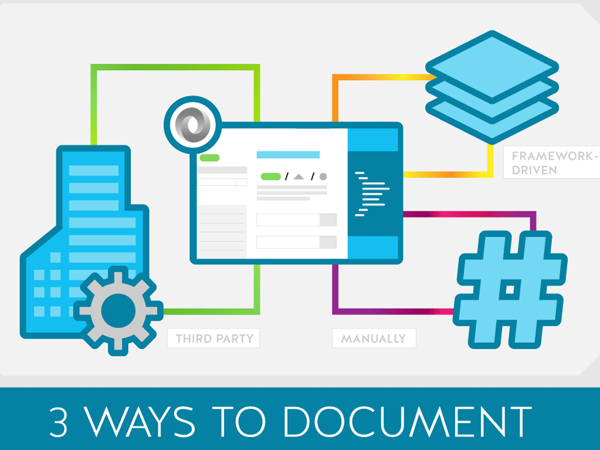
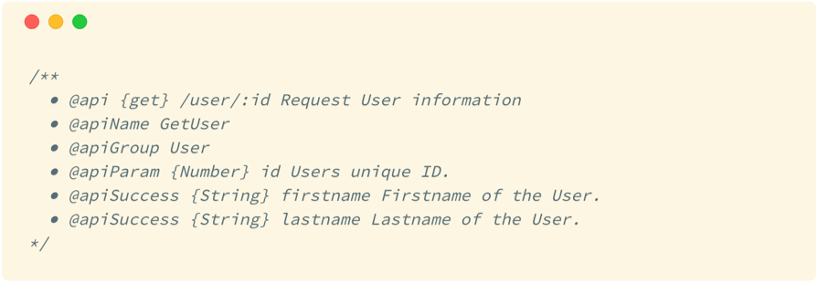
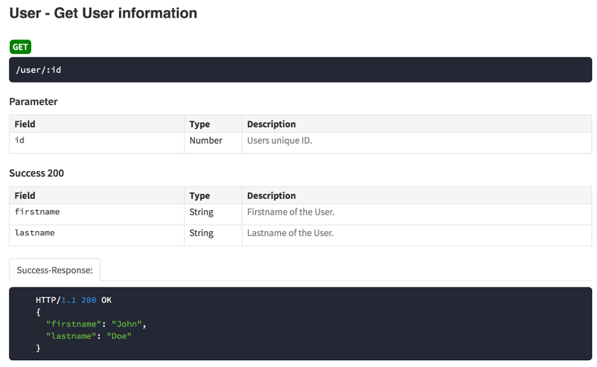
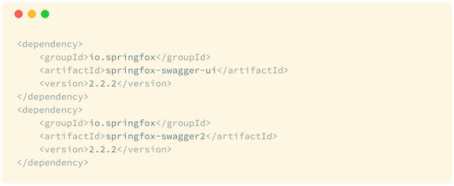
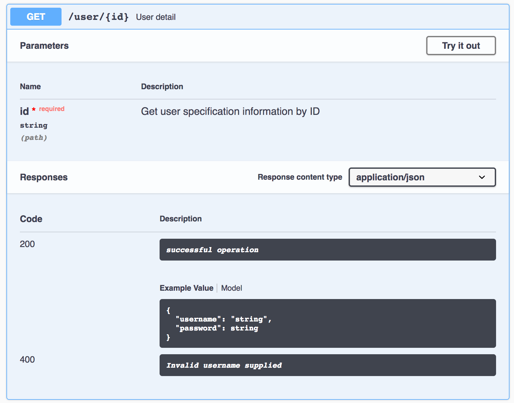
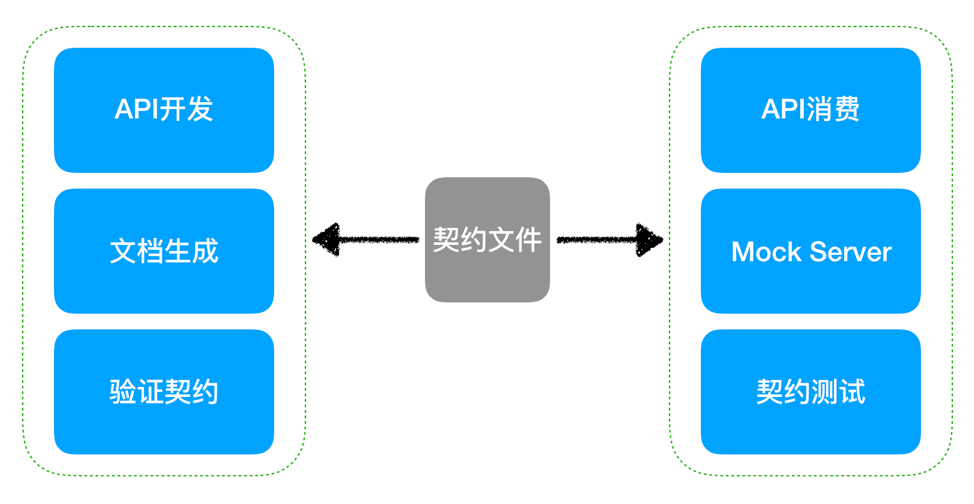

在上一篇文章——《细说API - 重新认识RESTful》中介绍了如何理解和设计RESTful风格的API，现在我们来聊聊如何有效的呈现API文档，以及前后端协作的方式。

我经历过一些没有文档的项目，前后端开发者坐到一起口口相传，或者有些团队用 word、pdf 来编写 API 文档。API 文档的缺乏给前后端协作带来困难，在缺乏专门工具的情况下，编写和维护文档是一件工作量巨大的事，人工处理也非常容易出错。
本文将会介绍三种方案来解决前后端协作的问题：

- **基于注释的 API 文档**：这是一种通过代码中注释生成 API 文档的轻量级方案，它的好处是简单易用，基本与编程语言无关。因为基于注释，非常适合动态语言的文档输出，例如 Nodejs、PHP、Python。由于NPM包容易安装和使用，这里推荐 nodejs 平台下的 apidocjs。
- **基于反射的 API 文档**：使用 swagger 这类通过反射来解析代码，只需要定义好 Model，可以实现自动输出 API 文档。这种方案适合强类型语言例如 Java、.Net，尤其是生成一份稳定、能在团队外使用的 API 文档。
- **使用契约进行前后端协作**：在团队内部，前后端协作本质上需要的不是一份 API 文档，而是一个可以供前后端共同遵守的契约。前后端可以一起制定一份契约，使用这份契约共同开发，前端使用这份契约 mock API，后端则可以通过它简单的验证API是否正确输出。

## 基于注释的 API 文档

apidocjs 是生成文档最轻量的一种方式，apidocjs 作为 npm 包发布，运行在 nodejs 平台上。原理为解析方法前面的注释，使用方法非常类似 javadoc 等程序接口文档生成工具，配置和使用都非常简单。因为只是解析代码注释部分，理论上和编程语言无关。

安装：

> npm install apidoc -g

在需要输出文档的源代码中添加一个一个注释示例：

最小化运行：

> apidoc -i myapp/ -o apidoc

即可在 apidoc 中输出静态的 html 文档目录。如果指定配置文件 apidoc.json 可以定义更多的操作方式，也可以自定义一套 HTML 模板用于个性化显示你的 API 文档，另外在输出的 HTML 文档中附带有API请求的测试工具，可以在我们生成的文档中尝试调用 API。

使用 apidocjs 只需要添加几个例如 @api、@apiname、@apiParam 等几个必要的注释即可，值得一提是 @apiDefine 可以定义变量避免重复书写，@apiGroup 用来对 API 分组，@apiVersion 可以再生成不同版本的文档。

## 基于反射的 API 文档

apidoc 的缺点是需要维护一些注释，当修改源代码时需要注意注释是否同时被更新。不过如果你使用的是 Java、.Net 等强类型语言，就可以利用强类型语言的优势。
在这个领域最好用的文档工具当属 swagger，swagger 实际上是一整套关于 API 文档、代码生成、测
试、文档共享的工具包，包括 :

- Swagger Editor 使用 swagger editor 编写文档定义 yml 文件，并生成 swagger 的 json 文件
- Swagger UI 解析 swagger 的 json 并生成 html 静态文档
- Swagger Codegen 可以通过 json 文档生成 Java 等语言里面的模板文件（模型文件）
- Swagger Inspector API 自动化测试
- Swagger Hub 共享 swagger 文档

通常我们提到 swagger 时，往往指的是 swagger ui。而在 Java 环境下，可以通过 Springfox 来完成对代码的解析，再利用 swagger 生成文档，下面我们给一个简单的例子看怎么给一个 Spring boot 项目生成文档。

首选加入依赖（gradle 同理）：

全局配置：

我们的 controller，需要定义一些必要的注解来描述这个 API 的标题和解释，我们返回的 user 对象是一个简单 value object，swagger-annotations 包下面提供了很多注解可以满足更多的定制需求。

然后访问你的 context 下的 /{context}/swagger-ui.html 页面，你会看到一个漂亮的 API 在线文档。swagger 的文档上能看到具体的字段定义和 Model，如果修改了 Model，再次编译后则可以自动反应到文档上，这也是反应了强类型编程语言的优势之一。

## 基于契约的前后端协作

在过去的开发中，往往是后端开发者占主导，像上面的两种方案中，直接注释、反射通过生成 API 文档。
但前后端分离后让合作方式发生了变化。传统的方式往往是服务器开发者完成了 API 开发之后，前端开发者再开始工作，在项目管理中这样产生时间线的依赖。理想的情况下，在需求明确后，架构师设计，前后端应该能各自独立工作，并在最后进行集成测试即可。

后端开发者可以根据文档实现接口，最后按照文档联合调试即可，甚至通过契约生成 API 调用和数据承载的 VO (Value Object)，减少工作量。如果 API 的提供者想做的更为完善一些，可以使用契约文件来验证实际 API 输出输出是否合理。

### 契约测试

当我们使用契约文件来提高前后端协作开发的体验，其中很重要的一部分就是契约测试，关于契约测试，我们一般指的是 Martin Fowler 提出的概念 —— “消费者驱动的契约”
简单来说，就是前后端开发者协定好后，由消费者驱动，通过编写 API 调用层相关的代码，可以直接生成契约文件。由于一个 API 可以被多处消费，所以消费者驱动可以更好的管理契约的变化（如果 API 验证契约时不能通过，说明契约被破坏了，可以在 CI 上马上反应出来）。

(Pact 契约测试模型)

写契约测试的博客非常多，就不展开赘述了。我把契约测试放到了前后端协作这个部分，是因为契约测试的前提是建立在前后端良好的协作下实现的。“契约测试”关注的是契约，而不是测试。

实际工作中，退一步说，制定好契约就可以完成基本的开发工作，对契约测试、验证可以让前后端协作变得更为可靠。如果你现在还没准备好使用契约测试的话，也不必焦虑，手动定义契约可以让前后端协作先运行起来。

而如果你恰好使用了 Spring boot 全家桶的话，不妨看看 Spring cloud contract。

### 使用 Swagger Yaml 契约

前面在讲 swagger 的时候，提到了Swagger Editor，使用这个工具可以通过编写 API 定义文件（Yaml格式），它提供线上版本，也可以本地使用。

后端通过生成 API 定义文件，就可以进一步完成生成 HTML 静态文档、模拟 API 数据等操作。
前端开发者可以通过 swagger 的 node 版本 swagger-node 自带的 mock 模式启动一个 Mock server，然后根据约定模拟自己想要的数据。 关于在前端使用的 mock server，实在太多，而且各有优劣，在附录中有一个清单以供参考，不再赘述。

### 使用 RAML 契约

使用 Swagger Yaml 契约或者 Pact 契约都能在一定程度上完成契约测试、生成文档、mock 等工作，但是我们在实际工作中发现这些工具和平台的契约规则并不相同。

Swagger 在生成文档上非常优秀，然而在契约测试上不及 Pact，反之亦然。

随着引入微服务和开放的互联网项目越来越多，前后端协作的问题越来越明显，而解决上述问题的工具和技术并不通用。好在业界早已认识到这个问题，于是一些组织提出了 RestFul API 统一建模语言 （RESTful API Modeling Language），也就是 RAML。

围绕着 RAML 这一标准，构建出 API 协作的工具链，设计、构建、测试、文档、共享。

## 其他前后端协作实践

### 中心文档服务器

在一个大型的团队中，可能会有几十个以上的项目同时提供了 API，这种情况下如果每个应用都各自提供API文档就会变得很难管理，如果将 API 文档绑定到应用服务上会带来一些无意义的损耗。可以使用一个集中地服务来存放这些文档，类似于 github 的私有仓库，swagger 同样也提供了类似的服务 - swaggerhub.com。

即使不使用 swagger ，我们可以构建出 HTML 文档然后每一次输出部署到一台静态服务器，也是非常容易的事情。

如果是开源或者对外的 API，可以借用 GitHub Page 来创建我们的文档服务
针对团队内部，诸多云服务商均提供了静态服务器，例如 AWS 的 S3

### 管理契约文件

既然是契约文件，就不应该是API提供者或者消费者单独拥有的，即使只有一个调用方，至少是前端、后端共同拥有的。

那么契约文件应该怎么放呢？

我们之前一直放到API的代码仓库中，然后给所有的人添加了权限。后来发现这样做非常不方便，于是单独增加了一个管理契约文件的 git仓库，并使用 git 的submodule 来引用到各个涉及到了的代码仓库中。
将契约文件单独放置还有一个额外的好处，在构建契约测试时，可以方便的发送到一台中间服务器。一旦 API 契约发生变化，可以触发 API提供的契约验证测试。

### 附录：API 文档工具清单

使用或调研过的，API 文档/契约生成工具

- apidoc
- swagger
- blue sprint
- RAML

使用或调研过得 mock 工具清单

- wiremock
- json-server
- node-mock-server
- node-mocks-http

HTTP 请求拦截器

- axios-mock-adapter
- jquery-mockjax

契约/API 测试工具

- Spring Cloud Contract
- Pact
- Rest-Assured
