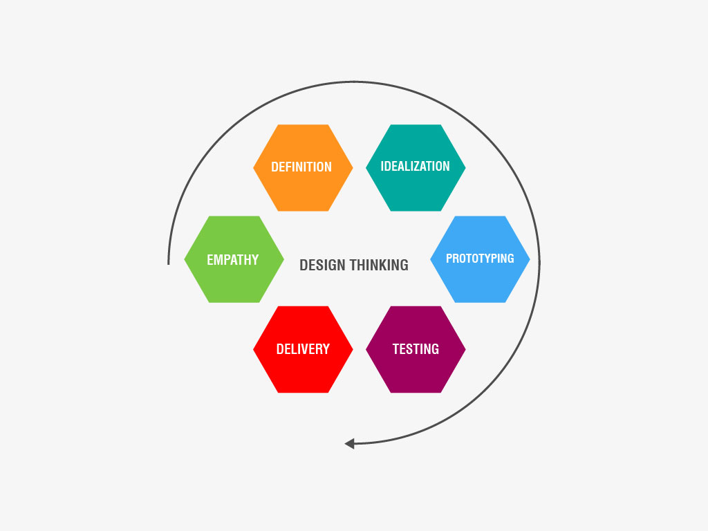
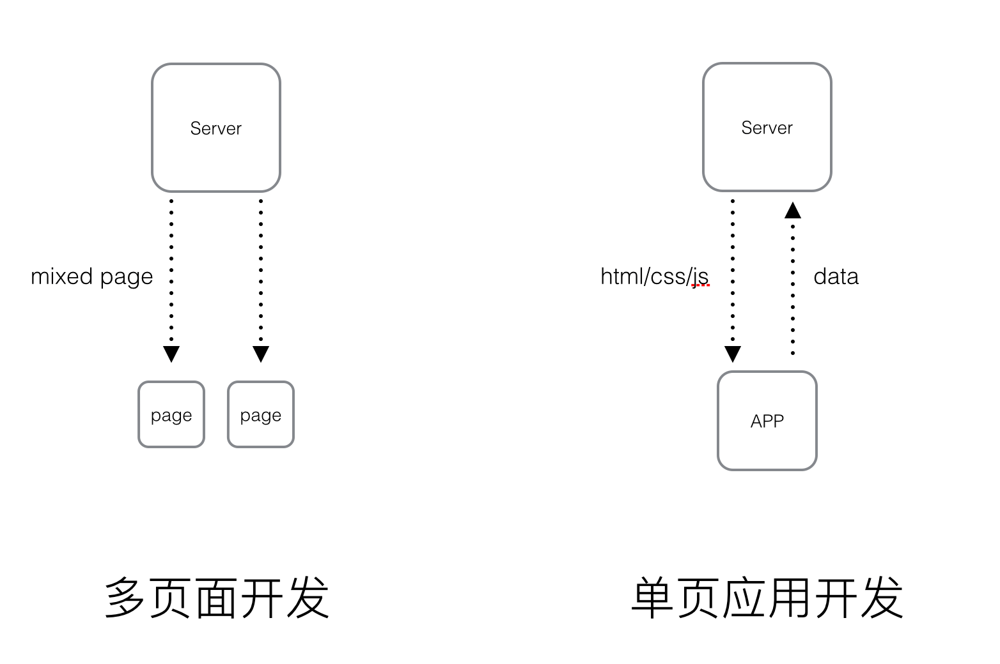

## 从切图开始 

在几周以前的一个周末去了趟上海，除了感受了魔都的快节奏生活之外，作为前端的面试官参加了上海分公司的面试Open Day活动。 

在Open Day，候选人一天就能拿到Offer，但是需要完成现场作业、结对编程等环节。我们的现场作业题目是模拟操作一个火星车方阵，根据输入的数据，程序来完成放置火星车、左右转、前进等场景。这个题目实现并不难，设计该题目的目的是为了考察候选人程序设计、代码风格和工程化的能力。 

很快，陆陆续续有一些候选人完成了现场作业，有的是在Node.js平台上完成，用变量模拟数据的输入，用面向对象的方式给火星车分配了实例，然后操作这些实例完成了任务。还有一些使用了JavaScript文件和一个简单的HTML文件加载到浏览器中运行。随着时间的过去，一个女生迟迟没有提交，时间到后，我上前检查，她编写一个HTML页面，然后使用JavaScript操作dom元素来了移动页面上的"火星车"，JavaScript脚本耦合在HTML文档中。这个女生告诉我她以为不能使用JQuery，于是使用原生JavaScript，因此遇到了很多问题以至于不能及时完成。结果可想而知。 

这件事给我的触动很大，也为这位候选人没能通过面试感到遗憾。其实我们期待的作业是一个可以正确运行的"程序"，无论是面向对象的设计还是函数式的设计，而这位候选人关注在"页面"，甚至HTML和JavaScript都没有分离，只有几个响应DOM事件的JavaScript函数。显然这位候选人对我们的题目理解并不一样，那么不同工程师之间的思维差异是怎样的呢。

我想到了 "编程思想"，我不算正经的科班生，但犹记得在读书期间像老师请教过关于编程的内容，老师提到最多的就是"编程思想"。在后面的前几年开发生涯中，也在不断思考这个问题，怎么样才能算具有开发思想，怎么去设计程序和组织代码才是最好的。貌似在做过不少项目，上线过很多应用后，也没有得到答案，甚至随着身边的人水平不断增高，这个问题不再被提起。 在前几年，前后端开发还没有分离时，当时的开发模式为前端编写页面、CSS和少量的JavaScript，随后由后端开发者来集成到项目中去。前端不仅备受歧视，并且因为交付产物不是完整的程序，甚至并不被当做"程序员"，业内黑话叫 "切页面的"。当时的行情是会使用jQuery或原生JS编写组件的很值钱，否则"页面仔"并不值钱。 

## 怎么从前端找到编程思维？ 
前后端分离是一个非常好的契机，改变了前端的开发模式，前后端分离后的前端项目又叫做单页应用（SPA），这种应用不像传统的页面会发生跳转，页面的跳转由视图的切换代替。 

前后端分离后开发者需要理解的第一件事是：前端应用变成了一个运行在浏览器的完整的程序。JavaScript不再是完成页面上特效的小玩意儿了，需要承担起管理数据、处理用户相应和渲染页面的职责。最早带来这种革命的应用是Gmail, Gmail被认为是第一个富前端应用程序。随后Backbone把MVC思维带到了前端，AngularJS的双向绑定让富前端开发变得非常容易和简单，开启了富前端应用第一个高潮。 

前端开发是做一个完整的应用程序的例子是一个代办记事列表应用，这也是前端开发框架往往使用的的经典案例，不亚于Hello world。

马上体验：http://todomvc.com

## 程序是什么？ 

我们说要具有编程思维，那我们先说说程序是什么，百科的说法是： 

计算机程序又称“计算机软件”，通过指令的顺序，使计算机能按所要求的功能进行精确记述的逻辑方法。 

这个定义需要首先理解计算机是什么，然而我们不用想的这么复杂。通俗来说，计算机就像一个听话而行事准确的奴隶，人类只需要给出确切的命令和输入就可以干活，否则就会报错。 前端应用程序和服务器、桌面程序的差异在于他们的运行环境不同。桌面程序可以随意调用系统API，实现几乎所有的功能；服务器程序没有界面，就像《黑客帝国》中被关起来的锁匠一样，暗无天日的解决问题即可；前端应用寄宿在浏览器这个容器中，就像银行柜员一样响应用的需求，传递给后台。 

传统程序把数据和页面混合后发送给浏览器，现代的前端应用是把页面和JavaScript发送给浏览器，然后前端接了一个小水管（API）获取数据，然后前端自己加工渲染到页面。于是web前端应用程序越来越像真正的客户端应用了。 

## 建立前端的APP的编程思想 

有一道经典的前端面试题是考察浏览器载入页面时的加载顺序，从这个角度出发，页面的加载到用户关闭窗口，就类似于桌面客户端启动和退出。 因为传统的的页面，从加载渲染到用户关闭这个窗口只用了很短的时间，窗口随即被销毁，就像一个一次性的用品，浏览器和HTTP协议帮我们管理了很多东西，因此我们不比考虑数据的管理、内存的分配、代码的组织。 

当我们的从多页面开发转向到单页应用时，这些问题就不得不重新思考： 

*APP的生命周期* 在多页面开发时，数据和HTML混合后和css、JavaScript片段被发送到浏览器，HTML和CSS被渲染后JavaScript需要做的只是注册事件，大部分事情都是服务器和浏览器来完成的，JavaScript起到的作用并不是特别大。这种方式造成了用户操作时反复请求、加载、渲染，用户会受到白屏、等待和操作不流畅等糟糕体验。在单页应用时代，HTML\css\js被作为入口打包后发送给浏览器，然后使用JavaScript像普通客户端程序一样启动，开始拉取数据、构建页面、绑定事件后对用户做出响应，用户发生操作再进行拉取数据、重新渲染，页面之间使用DOM视图切换完成，最终用户退出该页面后数据被释放。 

*数据管理和垃圾回收* 前后端分离的本质是HTML/CSS/JS组成的应用程序和数据进行分离，HTML/CSS/JS从web容器中加载，数据从API加载，数据的处理需要JavaScript来完成，这也是为什么最早的MVC框架Backbone强制依赖了集合数据处理库underscore，在React的生态中很多开发者喜欢使用loadash。多页面开发时，页面切换或刷新后，数据和事件会被重置，但现在需要自己管理，直到用户退出前，程序持续运行，因此需要特别考虑一些数据的释放、变量引用指针是否正确、事件是否被重复绑定等问题。 

*组织代码* 在之前，JavaScript只是被当做浏览器的一个简单脚本。几乎没有代码结构而言，大量的行内的代码，好一点的放置到页面底部，或者使用外部JavaScript文件。慢慢的发展出一堆函数和方法集合的库，然后有一些面向对象的实践。因为页面加载一次后就被释放，JavaScript往往是小量的，并且通常每个页面之间用到的独立JavaScript片段构成。单页应用中，应用程序被作为一个整体加载，程序运行的逻辑发生了不小的变化： 

  1.   程序应该使用统一的入口来初始化整个应用 
  2.  对各个功能组件进行拆分。拆分是为了更好的组合，只有良好的解耦才能最大化的重新组合各个组件 
  3.  学习面向对象思想。面向对象可以让组件职责更加清晰 
  4.  数据和视图拆分，使用数据驱动视图 
  5.  了解设计模式。设计模式是组织大型应用程序代码的"套路"，可以自己设计好良好的代码，也可以参考现成的模式。例如当我第一次看到Redux的dispatch实现时，脑子第一想法是这玩意儿和Window上的MFC消息机制非常像。 

 总之，单页应用是一个独立的应用程序，而不是"堆砌的意大利面条的代码"。 

*工程化*  既然是独立的应用程序，为什么前端不能工程化。 我们的程序是需要运行在浏览器中，加上可能会使用ES6、Less等非原生的开发工具，就需要进行构建编译然后打包成能在浏览器上运行的程序。 这个过程在C/C++中有make，JAVA中有Maven。而前端的工程化生态比较分散，JavaScript的预处理语言、包管理工具、构建工具都有很多。 

前端的工程化需要考虑的有： 

  1. 合理的工程结构
  2. 工程构建
  3. 版本管理 
  4. 持续集成 

## 写在最后

前端的发展历史正是一个从网页设计到软件设计的过程，在这个过程中，开发者的思维需要发生彻底的变化。前端领域使用的技术越来越和其他平台的客户端贯通，例如Angularjs中的MVVM很大一部分从.net中学习到的；数据和视图分离，面向对象和函数式编程也是前端领域重要的思维；另外一个方面前端也在慢慢的影响其他领域，JavaScript的事件和异步等特性也让java世界发生变化。

我们不一定要成为全栈工程师，但需要拓宽技术眼界然后探究编程世界的内在本质，这样才能在学习和应用新的新的东西时得心应手，快速的在框架、平台、技术栈中切换。 
就像在我们认为写AngularJS的时候，其实我们写的是JavaScript；当我们认为在写JavaScript的时，更多的需要意识到我们在编写可以被计算机运行的应用程序。 