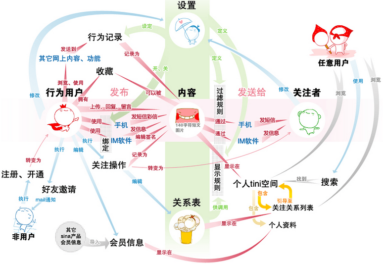
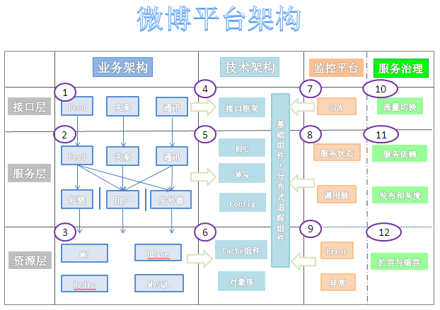

## 序言

新浪微博在 2014 年 3 月公布的月活跃用户（MAU）已经达到 1.43 亿，2014 年新年第一分钟发送的微博达 808298 条，如此巨大的用户规模和业务量，需要高可用（HA）、高并发访问、低延时的强大后台系统支撑。

微博平台第一代架构为 LAMP 架构，数据库使用的是 MyIsam，后台用的是 php，缓存为 Memcache。

随着应用规模的增长，衍生出的第二代架构对业务功能进行了模块化、服务化和组件化，后台系统从 php 替换为 Java，逐渐形成 SOA 架构，在很长一段时间支撑了微博平台的业务发展。

在此基础上又经过长时间的重构、线上运行、思索与沉淀，平台形成了第三代架构体系。

我们先看一张微博的核心业务图（如下），是不是非常复杂？但这已经是一个简化的不能再简化的业务图了，第三代技术体系就是为了保障在微博核心业务上快速、高效、可靠地发布新产品新功能。

## 第三代技术体系

微博平台的第三代技术体系，使用正交分解法建立模型：在水平方向，采用典型的三级分层模型，即接口层、服务层与资源层；在垂直方向，进一步细分为业务架构、技术架构、监控平台与服务治理平台。下面是平台的整体架构图：

如上图所示，正交分解法将整个图分解为 3*4=12 个区域，每个区域代表一个水平维度与一个垂直维度的交点，相应的定义这个区域的核心功能点，比如区域 5 主要完成服务层的技术架构。

下面详细介绍水平方向与垂直方向的设计原则，尤其会重点介绍 4、5、6 中的技术组件及其在整个架构体系中的作用。

## 水平分层

水平维度的划分，在大中型互联网后台业务系统的设计中非常基础，在平台的每一代技术体系中都有体现。这里还是简单介绍一下，为后续垂直维度的延伸讲解做铺垫：

1. 接口层主要实现与 Web 页面、移动客户端的接口交互，定义统一的接口规范，平台最核心的三个接口服务分别是内容（Feed）服务、用户关系服务及通讯服务（单发私信、群发、群聊）。
2. 服务层主要把核心业务模块化、服务化，这里又分为两类服务，一类为原子服务，其定义是不依赖任何其他服务的服务模块，比如常用的短链服务、发号器服务都属于这一类。图中使用泳道隔离，表示它们的独立性。另外一类为组合服务，通过各种原子服务和业务逻辑的组合来完成服务，比如 Feed 服务、通讯服务，它们除了本身的业务逻辑，还依赖短链、用户及发号器服务。
3. 资源层主要是数据模型的存储，包含通用的缓存资源 Redis 和 Memcached，以及持久化数据库存储 MySQL、HBase，或者分布式文件系统 TFS 以及 Sina S3 服务。

水平分层有一个特点，依赖关系都是从上往下，上层的服务依赖下层，下层的服务不会依赖上层，构建了一种简单直接的依赖关系。

与分层模型相对应，微博系统中的服务器主要包括三种类型：前端机（提供 API 接口服务）、队列机（处理上行业务逻辑，主要是数据写入）和存储（mc、mysql、mcq、redis 、HBase 等）。

## 垂直延伸技术架构

随着业务架构的发展和优化，平台研发实现了许多卓越的中间件产品，用来支撑核心业务，这些中间件由业务驱动产生，随着技术组件越来越丰富，形成完备的平台技术框架，大大提升了平台的产品研发效率和业务运行稳定性。

区别于水平方向上层依赖下层的关系，垂直方向以技术框架为地基支撑点，向两侧驱动影响业务架构、监控平台、服务治理平台，下面介绍一下其中的核心组件。

## 接口层 Web V4 框架

接口框架简化和规范了业务接口开发工作，将通用的接口层功能打包到框架中，采用了 Spring 的面向切面（AOP）设计理念。接口框架基于 Jersey 进行二次开发，基于 annotation 定义接口 (url, 参数)，内置 Auth、频次控制、访问日志、降级功能，支撑接口层监控平台与服务治理，同时还有自动化的 Bean-json/xml 序列化。

## 服务层框架

服务层主要涉及 RPC 远程调用框架以及消息队列框架，这是微博平台在服务层使用最为广泛的两个框架。

### MCQ 消息队列

消息队列提供一种先入先出的通讯机制，在平台内部，最常见的场景是将数据的落地操作异步写入队列，队列处理程序批量读取并写入 DB，消息队列提供的异步机制加快了前端机的响应时间，其次，批量的 DB 操作也间接提高了 DB 操作性能，另外一个应用场景，平台通过消息队列，向搜索、大数据、商业运营部门提供实时数据。

微博平台内部大量使用的 MCQ(SimpleQueue Service Over Memcache) 消息队列服务，基于 MemCache 协议，消息数据持久化写入 BerkeleyDB，只有 get/set 两个命令，同时也非常容易做监控（stats queue），有丰富的 client library，线上运行多年，性能比通用的 MQ 高很多倍。

### Motan RPC 框架

微博的 Motan RPC 服务，底层通讯引擎采用了 Netty 网络框架，序列化协议支持 Hessian 和 Java 序列化，通讯协议支持 Motan、http、tcp、mc 等，Motan 框架在内部大量使用，在系统的健壮性和服务治理方面，有较为成熟的技术解决方案，健壮性上，基于 Config 配置管理服务实现了 High Availability 与 Load Balance 策略（支持灵活的 FailOver 和 FailFast HA 策略，以及 Round Robin、LRU、Consistent Hash 等 Load Balance 策略），服务治理方面，生成完整的服务调用链数据，服务请求性能数据，响应时间（Response Time）、QPS 以及标准化 Error、Exception 日志信息。

## 资源层框架

资源层的框架非常多，有封装 MySQL 与 HBase 的 Key-List DAL 中间件、有定制化的计数组件，有支持分布式 MC 与 Redis 的 Proxy，在这些方面业界有较多的经验分享，我在这里分享一下平台架构的对象库与 SSD Cache 组件。

### 对象库

对象库支持便捷的序列化与反序列化微博中的对象数据：序列化时，将 JVM 内存中的对象序列化写入在 HBase 中并生成唯一的 ObjectID，当需要访问该对象时，通过 ObjectID 读取，对象库支持任意类型的对象，支持 PB、JSON、二进制序列化协议，微博中最大的应用场景将微博中引用的视频、图片、文章统一定义为对象，一共定义了几十种对象类型，并抽象出标准的对象元数据 Schema，对象的内容上传到对象存储系统（Sina S3）中，对象元数据中保存 Sina S3 的下载地址。

### SSDCache

随着 SSD 硬盘的普及，优越的 IO 性能使其被越来越多地用于替换传统的 SATA 和 SAS 磁盘，常见的应用场景有三种：1）替换 MySQL 数据库的硬盘，目前社区还没有针对 SSD 优化的 MySQL 版本，即使这样，直接升级 SSD 硬盘也能带来 8 倍左右的 IOPS 提升；2）替换 Redis 的硬盘，提升其性能；3）用在 CDN 中，加快静态资源加载速度。

微博平台将 SSD 应用在分布式缓存场景中，将传统的 Redis/MC + Mysql 方式，扩展为 Redis/MC + SSD Cache + Mysql 方式，SSD Cache 作为 L2 缓存使用，第一降低了 MC/Redis 成本过高，容量小的问题，也解决了穿透 DB 带来的数据库访问压力。

## 垂直的监控与服务治理

随着服务规模和业务变得越来越复杂，即使业务架构师也很难准确地描述服务之间的依赖关系，服务的管理运维变得越来难，在这个背景下，参考 google 的 dapper 和 twitter 的 zipkin，平台实现了自己的大型分布式追踪系统 WatchMan。

### WatchMan 大型分布式追踪系统

如其他大中型互联网应用一样，微博平台由众多的分布式组件构成，用户通过浏览器或移动客户端的每一个 HTTP 请求到达应用服务器后，会经过很多个业务系统或系统组件，并留下足迹（footprint）。但是这些分散的数据对于问题排查，或是流程优化都帮助有限。对于这样一种典型的跨进程 / 跨线程的场景，汇总收集并分析这类日志就显得尤为重要。另一方面，收集每一处足迹的性能数据，并根据策略对各子系统做流控或降级，也是确保微博平台高可用的重要因素。要能做到追踪每个请求的完整调用链路；收集调用链路上每个服务的性能数据；能追踪系统中所有的 Error 和 Exception；通过计算性能数据和比对性能指标（SLA）再回馈到控制流程（control flow）中，基于这些目标就诞生了微博的 Watchman 系统。

该系统设计的一个核心原则就是低侵入性（non-invasivenss）：作为非业务组件，应当尽可能少侵入或者不侵入其他业务系统，保持对使用方的透明性，可以大大减少开发人员的负担和接入门槛。基于此考虑，所有的日志采集点都分布在技术框架中间件中，包括接口框架、RPC 框架以及其他资源中间件。

WatchMan 由技术团队搭建框架，应用在所有业务场景中，运维基于此系统完善监控平台，业务和运维共同使用此系统，完成分布式服务治理，包括服务扩容与缩容、服务降级、流量切换、服务发布与灰度。

## 结尾

现在，技术框架在平台发挥着越来越重要的作用，驱动着平台的技术升级、业务开发、系统运维服务，本文限于篇幅限制，没有展开介绍，后续会不断地介绍核心中间件的设计原则和系统架构。

本文[首发](http://mp.weixin.qq.com/s?__biz=MzA4ODAyOTI4Ng==&mid=201317014&idx=1&sn=51d985f13d2d22f7c49654ef7cda0167#rd)于“微博平台架构”微信公众号，发布时有少量的文字润色和调整。

## 关于作者

卫向军（[ @卫向军 _ 微博](http://weibo.com/xiangjunwei)），毕业于北京邮电大学，现任微博平台架构师，先后在微软、金山云、新浪微博从事技术研发工作，专注于系统架构设计、音视频通讯系统、分布式文件系统和数据挖掘等领域。
