**Redis 是什么**

**面试官：**你先来说下 Redis 是什么吧！

**我：**（这不就是总结下 Redis 的定义和特点嘛）Redis 是 C 语言开发的一个开源的（遵从 BSD 协议）高性能键值对（key-value）的内存数据库，可以用作数据库、缓存、消息中间件等。

它是一种 NoSQL（not-only sql，泛指非关系型数据库）的数据库。

我顿了一下，接着说，Redis 作为一个内存数据库：

- 性能优秀，数据在内存中，读写速度非常快，支持并发 10W QPS。
- 单进程单线程，是线程安全的，采用 IO 多路复用机制。
- 丰富的数据类型，支持字符串（strings）、散列（hashes）、列表（lists）、集合（sets）、有序集合（sorted sets）等。
- 支持数据持久化。
  可以将内存中数据保存在磁盘中，重启时加载。
- 主从复制，哨兵，高可用。
- 可以用作分布式锁。
- 可以作为消息中间件使用，支持发布订阅。

**五种数据类型**

**面试官：**总结的不错，看来是早有准备啊。刚来听你提到 Redis 支持五种数据类型，那你能简单说下这五种数据类型吗？

**我：**当然可以，但是在说之前，我觉得有必要先来了解下 Redis 内部内存管理是如何描述这 5 种数据类型的。

说着，我拿着笔给面试官画了一张图：

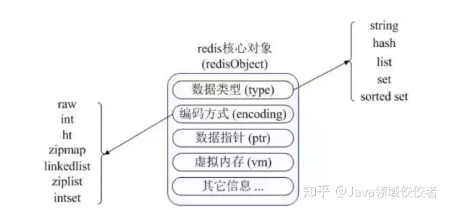


**我：**首先 Redis 内部使用一个 redisObject 对象来表示所有的 key 和 value。

redisObject 最主要的信息如上图所示：type 表示一个 value 对象具体是何种数据类型，encoding 是不同数据类型在 Redis 内部的存储方式。

比如：type=string 表示 value 存储的是一个普通字符串，那么 encoding 可以是 raw 或者 int。

我顿了一下，接着说，下面我简单说下 5 种数据类型：

①String 是 Redis 最基本的类型，可以理解成与 Memcached一模一样的类型，一个 Key 对应一个 Value。Value 不仅是 String，也可以是数字。

String 类型是二进制安全的，意思是 Redis 的 String 类型可以包含任何数据，比如 jpg 图片或者序列化的对象。String 类型的值最大能存储 512M。

②Hash是一个键值（key-value）的集合。Redis 的 Hash 是一个 String 的 Key 和 Value 的映射表，Hash 特别适合存储对象。常用命令：hget，hset，hgetall 等。

③List 列表是简单的字符串列表，按照插入顺序排序。可以添加一个元素到列表的头部（左边）或者尾部（右边） 常用命令：lpush、rpush、lpop、rpop、lrange（获取列表片段）等。

应用场景：List 应用场景非常多，也是 Redis 最重要的数据结构之一，比如 Twitter 的关注列表，粉丝列表都可以用 List 结构来实现。

数据结构：List 就是链表，可以用来当消息队列用。Redis 提供了 List 的 Push 和 Pop 操作，还提供了操作某一段的 API，可以直接查询或者删除某一段的元素。

实现方式：Redis List 的是实现是一个双向链表，既可以支持反向查找和遍历，更方便操作，不过带来了额外的内存开销。

④Set 是 String 类型的无序集合。集合是通过 hashtable 实现的。Set 中的元素是没有顺序的，而且是没有重复的。常用命令：sdd、spop、smembers、sunion 等。

应用场景：Redis Set 对外提供的功能和 List 一样是一个列表，特殊之处在于 Set 是自动去重的，而且 Set 提供了判断某个成员是否在一个 Set 集合中。

⑤Zset 和 Set 一样是 String 类型元素的集合，且不允许重复的元素。常用命令：zadd、zrange、zrem、zcard 等。

使用场景：Sorted Set 可以通过用户额外提供一个优先级（score）的参数来为成员排序，并且是插入有序的，即自动排序。

当你需要一个有序的并且不重复的集合列表，那么可以选择 Sorted Set 结构。

和 Set 相比，Sorted Set关联了一个 Double 类型权重的参数 Score，使得集合中的元素能够按照 Score 进行有序排列，Redis 正是通过分数来为集合中的成员进行从小到大的排序。

实现方式：Redis Sorted Set 的内部使用 HashMap 和跳跃表（skipList）来保证数据的存储和有序，HashMap 里放的是成员到 Score 的映射。

而跳跃表里存放的是所有的成员，排序依据是 HashMap 里存的 Score，使用跳跃表的结构可以获得比较高的查找效率，并且在实现上比较简单。

**数据类型应用场景总结：**

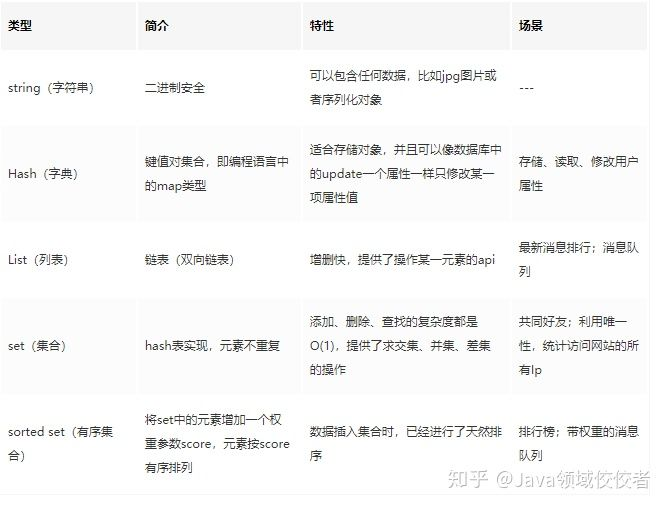


**面试官：**想不到你平时也下了不少工夫，那 Redis 缓存你一定用过的吧？

**我：**用过的。

**面试官：**那你跟我说下你是怎么用的？

我是结合 Spring Boot 使用的。一般有两种方式，一种是直接通过 RedisTemplate 来使用，另一种是使用 Spring Cache 集成 Redis（也就是注解的方式）。

**Redis 缓存**

直接通过 RedisTemplate 来使用，使用 Spring Cache 集成 Redis pom.xml 中加入以下依赖：

```text
<dependencies>
    <dependency>
        <groupId>org.springframework.boot</groupId>
        <artifactId>spring-boot-starter-data-redis</artifactId>
    </dependency>
    <dependency>
        <groupId>org.apache.commons</groupId>
        <artifactId>commons-pool2</artifactId>
    </dependency>
    <dependency>
        <groupId>org.springframework.boot</groupId>
        <artifactId>spring-boot-starter-web</artifactId>
    </dependency>
    <dependency>
        <groupId>org.springframework.session</groupId>
        <artifactId>spring-session-data-redis</artifactId>
    </dependency>

    <dependency>
        <groupId>org.projectlombok</groupId>
        <artifactId>lombok</artifactId>
        <optional>true</optional>
    </dependency>
    <dependency>
        <groupId>org.springframework.boot</groupId>
        <artifactId>spring-boot-starter-test</artifactId>
        <scope>test</scope>
    </dependency>
</dependencies>
```

**spring-boot-starter-data-redis：**在 Spring Boot 2.x 以后底层不再使用 Jedis，而是换成了 Lettuce。

**commons-pool2：**用作 Redis 连接池，如不引入启动会报错。

**spring-session-data-redis：**Spring Session 引入，用作共享 Session。

配置文件 application.yml 的配置：

```text
server:
  port: 8082
  servlet:
    session:
      timeout: 30ms
spring:
  cache:
    type: redis
  redis:
    host: 127.0.0.1
    port: 6379
    password:
    # redis默认情况下有16个分片，这里配置具体使用的分片，默认为0
    database: 0
    lettuce:
      pool:
        # 连接池最大连接数(使用负数表示没有限制),默认8
        max-active: 100
```

创建实体类 User.java：

```text
public class User implements Serializable{

    private static final long serialVersionUID = 662692455422902539L;

    private Integer id;

    private String name;

    private Integer age;

    public User() {
    }

    public User(Integer id, String name, Integer age) {
        this.id = id;
        this.name = name;
        this.age = age;
    }

    public Integer getId() {
        return id;
    }

    public void setId(Integer id) {
        this.id = id;
    }

    public String getName() {
        return name;
    }

    public void setName(String name) {
        this.name = name;
    }

    public Integer getAge() {
        return age;
    }

    public void setAge(Integer age) {
        this.age = age;
    }

    @Override
    public String toString() {
        return "User{" +
                "id=" + id +
                ", name='" + name + '\'' +
                ", age=" + age +
                '}';
    }
}
```


**RedisTemplate 的使用方式**

默认情况下的模板只能支持 RedisTemplate<String, String>，也就是只能存入字符串，所以自定义模板很有必要。

添加配置类 RedisCacheConfig.java：

```text
@Configuration
@AutoConfigureAfter(RedisAutoConfiguration.class)
public class RedisCacheConfig {

    @Bean
    public RedisTemplate<String, Serializable> redisCacheTemplate(LettuceConnectionFactory connectionFactory) {

        RedisTemplate<String, Serializable> template = new RedisTemplate<>();
        template.setKeySerializer(new StringRedisSerializer());
        template.setValueSerializer(new GenericJackson2JsonRedisSerializer());
        template.setConnectionFactory(connectionFactory);
        return template;
    }
}
```

测试类：

```text
@RestController
@RequestMapping("/user")
public class UserController {

    public static Logger logger = LogManager.getLogger(UserController.class);

    @Autowired
    private StringRedisTemplate stringRedisTemplate;

    @Autowired
    private RedisTemplate<String, Serializable> redisCacheTemplate;

    @RequestMapping("/test")
    public void test() {
        redisCacheTemplate.opsForValue().set("userkey", new User(1, "张三", 25));
        User user = (User) redisCacheTemplate.opsForValue().get("userkey");
        logger.info("当前获取对象：{}", user.toString());
    }
```

然后在浏览器访问，观察后台日志 http://localhost:8082/user/test


**使用 Spring Cache 集成 Redis**

Spring Cache 具备很好的灵活性，不仅能够使用 SPEL（spring expression language）来定义缓存的 Key 和各种 Condition，还提供了开箱即用的缓存临时存储方案，也支持和主流的专业缓存如 EhCache、Redis、Guava 的集成。

定义接口 UserService.java：

```text
public interface UserService {

    User save(User user);

    void delete(int id);

    User get(Integer id);
}
```

接口实现类 UserServiceImpl.java：

```text
@Service
public class UserServiceImpl implements UserService{

    public static Logger logger = LogManager.getLogger(UserServiceImpl.class);

    private static Map<Integer, User> userMap = new HashMap<>();
    static {
        userMap.put(1, new User(1, "肖战", 25));
        userMap.put(2, new User(2, "王一博", 26));
        userMap.put(3, new User(3, "杨紫", 24));
    }


    @CachePut(value ="user", key = "#user.id")
    @Override
    public User save(User user) {
        userMap.put(user.getId(), user);
        logger.info("进入save方法，当前存储对象：{}", user.toString());
        return user;
    }

    @CacheEvict(value="user", key = "#id")
    @Override
    public void delete(int id) {
        userMap.remove(id);
        logger.info("进入delete方法，删除成功");
    }

    @Cacheable(value = "user", key = "#id")
    @Override
    public User get(Integer id) {
        logger.info("进入get方法，当前获取对象：{}", userMap.get(id)==null?null:userMap.get(id).toString());
        return userMap.get(id);
    }
}
```

为了方便演示数据库的操作，这里直接定义了一个 Map<Integer,User> userMap。

这里的核心是三个注解：

- **@Cachable**
- **@CachePut**
- **@CacheEvict**


测试类：UserController

```text
@RestController
@RequestMapping("/user")
public class UserController {

    public static Logger logger = LogManager.getLogger(UserController.class);

    @Autowired
    private StringRedisTemplate stringRedisTemplate;

    @Autowired
    private RedisTemplate<String, Serializable> redisCacheTemplate;

    @Autowired
    private UserService userService;

    @RequestMapping("/test")
    public void test() {
        redisCacheTemplate.opsForValue().set("userkey", new User(1, "张三", 25));
        User user = (User) redisCacheTemplate.opsForValue().get("userkey");
        logger.info("当前获取对象：{}", user.toString());
    }


    @RequestMapping("/add")
    public void add() {
        User user = userService.save(new User(4, "李现", 30));
        logger.info("添加的用户信息：{}",user.toString());
    }

    @RequestMapping("/delete")
    public void delete() {
        userService.delete(4);
    }

    @RequestMapping("/get/{id}")
    public void get(@PathVariable("id") String idStr) throws Exception{
        if (StringUtils.isBlank(idStr)) {
            throw new Exception("id为空");
        }
        Integer id = Integer.parseInt(idStr);
        User user = userService.get(id);
        logger.info("获取的用户信息：{}",user.toString());
    }
}
```

用缓存要注意，启动类要加上一个注解开启缓存：

```text
@SpringBootApplication(exclude=DataSourceAutoConfiguration.class)
@EnableCaching
public class Application {

    public static void main(String[] args) {
        SpringApplication.run(Application.class, args);
    }

}
```

①先调用添加接口：http://localhost:8082/user/add


②再调用查询接口，查询 id=4 的用户信息：


可以看出，这里已经从缓存中获取数据了，因为上一步 add 方法已经把 id=4 的用户数据放入了 Redis 缓存 3、调用删除方法，删除 id=4 的用户信息，同时清除缓存：


④再次调用查询接口，查询 id=4 的用户信息：


没有了缓存，所以进入了 get 方法，从 userMap 中获取。

**缓存注解**

**①@Cacheable**

根据方法的请求参数对其结果进行缓存：

- **Key：**缓存的 Key，可以为空，如果指定要按照 SPEL 表达式编写，如果不指定，则按照方法的所有参数进行组合。
- **Value：**缓存的名称，必须指定至少一个（如 @Cacheable (value='user')或者 @Cacheable(value={'user1','user2'})）
- **Condition：**缓存的条件，可以为空，使用 SPEL 编写，返回 true 或者 false，只有为 true 才进行缓存。

**②@CachePut**

根据方法的请求参数对其结果进行缓存，和 @Cacheable 不同的是，它每次都会触发真实方法的调用。参数描述见上。

**③@CacheEvict**


根据条件对缓存进行清空：

- Key：同上。
- Value：同上。
- Condition：同上。
- allEntries：是否清空所有缓存内容，缺省为 false，如果指定为 true，则方法调用后将立即清空所有缓存。
- **beforeInvocation：**是否在方法执行前就清空，缺省为 false，如果指定为 true，则在方法还没有执行的时候就清空缓存。缺省情况下，如果方法执行抛出异常，则不会清空缓存。

缓存问题
**面试官：**看了一下你的 Demo，简单易懂。那你在实际项目中使用缓存有遇到什么问题或者会遇到什么问题你知道吗？

**我：**缓存和数据库数据一致性问题：分布式环境下非常容易出现缓存和数据库间数据一致性问题，针对这一点，如果项目对缓存的要求是强一致性的，那么就不要使用缓存。

我们只能采取合适的策略来降低缓存和数据库间数据不一致的概率，而无法保证两者间的强一致性。

合适的策略包括合适的缓存更新策略，更新数据库后及时更新缓存、缓存失败时增加重试机制。

**面试官：**Redis 雪崩了解吗？

**我：**我了解的，目前电商首页以及热点数据都会去做缓存，一般缓存都是定时任务去刷新，或者查不到之后去更新缓存的，定时任务刷新就有一个问题。

举个栗子：如果首页所有 Key 的失效时间都是 12 小时，中午 12 点刷新的，我零点有个大促活动大量用户涌入，假设每秒 6000 个请求，本来缓存可以抗住每秒 5000 个请求，但是缓存中所有 Key 都失效了。

此时 6000 个/秒的请求全部落在了数据库上，数据库必然扛不住，真实情况可能 DBA 都没反应过来直接挂了。

此时，如果没什么特别的方案来处理，DBA 很着急，重启数据库，但是数据库立马又被新流量给打死了。这就是我理解的缓存雪崩。

**我心想：**同一时间大面积失效，瞬间 Redis 跟没有一样，那这个数量级别的请求直接打到数据库几乎是灾难性的。

你想想如果挂的是一个用户服务的库，那其他依赖他的库所有接口几乎都会报错。

如果没做熔断等策略基本上就是瞬间挂一片的节奏，你怎么重启用户都会把你打挂，等你重启好的时候，用户早睡觉去了，临睡之前，骂骂咧咧“什么垃圾产品”。

**面试官摸摸了自己的头发：**嗯，还不错，那这种情况你都是怎么应对的？

**我：**处理缓存雪崩简单，在批量往 Redis 存数据的时候，把每个 Key 的失效时间都加个随机值就好了，这样可以保证数据不会再同一时间大面积失效。

```text
setRedis（key, value, time+Math.random()*10000）;
```

如果 Redis 是集群部署，将热点数据均匀分布在不同的 Redis 库中也能避免全部失效。

或者设置热点数据永不过期，有更新操作就更新缓存就好了（比如运维更新了首页商品，那你刷下缓存就好了，不要设置过期时间），电商首页的数据也可以用这个操作，保险。

**面试官：**那你了解缓存穿透和击穿么，可以说说他们跟雪崩的区别吗？

**我：**嗯，了解，先说下缓存穿透吧，缓存穿透是指缓存和数据库中都没有的数据，而用户（黑客）不断发起请求。

举个栗子：我们数据库的 id 都是从 1 自增的，如果发起 id=-1 的数据或者 id 特别大不存在的数据，这样的不断攻击导致数据库压力很大，严重会击垮数据库。

**我又接着说：**至于缓存击穿嘛，这个跟缓存雪崩有点像，但是又有一点不一样，缓存雪崩是因为大面积的缓存失效，打崩了 DB。

而缓存击穿不同的是缓存击穿是指一个 Key 非常热点，在不停地扛着大量的请求，大并发集中对这一个点进行访问，当这个 Key 在失效的瞬间，持续的大并发直接落到了数据库上，就在这个 Key 的点上击穿了缓存。

**面试官露出欣慰的眼光：**那他们分别怎么解决？

**我：**缓存穿透我会在接口层增加校验，比如用户鉴权，参数做校验，不合法的校验直接 return，比如 id 做基础校验，id<=0 直接拦截。

**面试官：**那你还有别的方法吗？

**我：**我记得 Redis 里还有一个高级用法布隆过滤器（Bloom Filter）这个也能很好的预防缓存穿透的发生。

它的原理也很简单，就是利用高效的数据结构和算法快速判断出你这个 Key 是否在数据库中存在，不存在你 return 就好了，存在你就去查 DB 刷新 KV 再 return。

缓存击穿的话，设置热点数据永不过期，或者加上互斥锁就搞定了。作为暖男，代码给你准备好了，拿走不谢。

```text
public static String getData(String key) throws InterruptedException {
        //从Redis查询数据
        String result = getDataByKV(key);
        //参数校验
        if (StringUtils.isBlank(result)) {
            try {
                //获得锁
                if (reenLock.tryLock()) {
                    //去数据库查询
                    result = getDataByDB(key);
                    //校验
                    if (StringUtils.isNotBlank(result)) {
                        //插进缓存
                        setDataToKV(key, result);
                    }
                } else {
                    //睡一会再拿
                    Thread.sleep(100L);
                    result = getData(key);
                }
            } finally {
                //释放锁
                reenLock.unlock();
            }
        }
        return result;
    }
```

**面试官：**嗯嗯，还不错。

Redis 为何这么快

**面试官：**Redis 作为缓存大家都在用，那 Redis 一定很快咯？

**我：**当然了，官方提供的数据可以达到 100000+ 的 QPS（每秒内的查询次数），这个数据不比 Memcached 差！

**面试官：**Redis 这么快，它的“多线程模型”你了解吗？（露出邪魅一笑）

**我：**您是想问 Redis 这么快，为什么还是单线程的吧。Redis 确实是单进程单线程的模型，因为 Redis 完全是基于内存的操作，CPU 不是 Redis 的瓶颈，Redis 的瓶颈最有可能是机器内存的大小或者网络带宽。

既然单线程容易实现，而且 CPU 不会成为瓶颈，那就顺理成章的采用单线程的方案了（毕竟采用多线程会有很多麻烦）。

**面试官：**嗯，是的。那你能说说 Redis 是单线程的，为什么还能这么快吗？

**我：**可以这么说吧，总结一下有如下四点：

- Redis 完全基于内存，绝大部分请求是纯粹的内存操作，非常迅速，数据存在内存中，类似于 HashMap，HashMap 的优势就是查找和操作的时间复杂度是 O(1)。
- 数据结构简单，对数据操作也简单。
- 采用单线程，避免了不必要的上下文切换和竞争条件，不存在多线程导致的 CPU 切换，不用去考虑各种锁的问题，不存在加锁释放锁操作，没有死锁问题导致的性能消耗。
- 使用多路复用 IO 模型，非阻塞 IO。


Redis 和 Memcached 的区别

**面试官：**嗯嗯，说的很详细。那你为什么选择 Redis 的缓存方案而不用 Memcached 呢？

**我：**原因有如下四点：

- **存储方式上：**Memcache 会把数据全部存在内存之中，断电后会挂掉，数据不能超过内存大小。Redis 有部分数据存在硬盘上，这样能保证数据的持久性。
- **数据支持类型上：**Memcache 对数据类型的支持简单，只支持简单的 key-value，，而 Redis 支持五种数据类型。
- **使用底层模型不同：**它们之间底层实现方式以及与客户端之间通信的应用协议不一样。Redis 直接自己构建了 VM 机制，因为一般的系统调用系统函数的话，会浪费一定的时间去移动和请求。
- **Value 的大小：**Redis 可以达到 1GB，而 Memcache 只有 1MB。

淘汰策略

**面试官：**那你说说你知道的 Redis 的淘汰策略有哪些？

**我：**Redis 有六种淘汰策略，如下图：

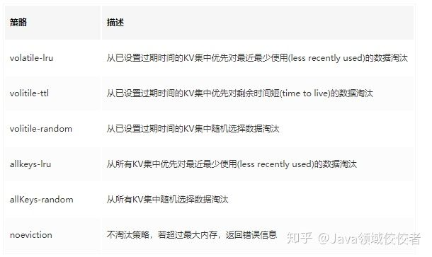

**补充一下：**Redis 4.0 加入了 LFU（least frequency use）淘汰策略，包括 volatile-lfu 和 allkeys-lfu，通过统计访问频率，将访问频率最少，即最不经常使用的 KV 淘汰。

持久化

**面试官：**你对 Redis 的持久化机制了解吗？能讲一下吗？

**我：**Redis 为了保证效率，数据缓存在了内存中，但是会周期性的把更新的数据写入磁盘或者把修改操作写入追加的记录文件中，以保证数据的持久化。

Redis 的持久化策略有两种：

- **RDB：**快照形式是直接把内存中的数据保存到一个 dump 的文件中，定时保存，保存策略。
- **AOF：**把所有的对 Redis 的服务器进行修改的命令都存到一个文件里，命令的集合。Redis 默认是快照 RDB 的持久化方式。

当 Redis 重启的时候，它会优先使用 AOF 文件来还原数据集，因为 AOF 文件保存的数据集通常比 RDB 文件所保存的数据集更完整。你甚至可以关闭持久化功能，让数据只在服务器运行时存。

**面试官：**那你再说下 RDB 是怎么工作的？

**我：**默认 Redis 是会以快照"RDB"的形式将数据持久化到磁盘的一个二进制文件 dump.rdb。

工作原理简单说一下：当 Redis 需要做持久化时，Redis 会 fork 一个子进程，子进程将数据写到磁盘上一个临时 RDB 文件中。

当子进程完成写临时文件后，将原来的 RDB 替换掉，这样的好处是可以 copy-on-write。

**我：**RDB 的优点是：这种文件非常适合用于备份：比如，你可以在最近的 24 小时内，每小时备份一次，并且在每个月的每一天也备份一个 RDB 文件。

这样的话，即使遇上问题，也可以随时将数据集还原到不同的版本。RDB 非常适合灾难恢复。

RDB 的缺点是：如果你需要尽量避免在服务器故障时丢失数据，那么RDB不合适你。

**面试官：**那你要不再说下 AOF？

**我：**（说就一起说下吧）使用 AOF 做持久化，每一个写命令都通过 write 函数追加到 appendonly.aof 中，配置方式如下：

```text
appendfsync yes   
appendfsync always     #每次有数据修改发生时都会写入AOF文件。
appendfsync everysec   #每秒钟同步一次，该策略为AOF的缺省策略。
```

AOF 可以做到全程持久化，只需要在配置中开启 appendonly yes。这样 Redis 每执行一个修改数据的命令，都会把它添加到 AOF 文件中，当 Redis 重启时，将会读取 AOF 文件进行重放，恢复到 Redis 关闭前的最后时刻。

我顿了一下，继续说：使用 AOF 的优点是会让 Redis 变得非常耐久。可以设置不同的 Fsync 策略，AOF的默认策略是每秒钟 Fsync 一次，在这种配置下，就算发生故障停机，也最多丢失一秒钟的数据。

缺点是对于相同的数据集来说，AOF 的文件体积通常要大于 RDB 文件的体积。根据所使用的 Fsync 策略，AOF 的速度可能会慢于 RDB。

**面试官又问：**你说了这么多，那我该用哪一个呢？

**我：**如果你非常关心你的数据，但仍然可以承受数分钟内的数据丢失，那么可以额只使用 RDB 持久。

AOF 将 Redis 执行的每一条命令追加到磁盘中，处理巨大的写入会降低Redis的性能，不知道你是否可以接受。

数据库备份和灾难恢复：定时生成 RDB 快照非常便于进行数据库备份，并且 RDB 恢复数据集的速度也要比 AOF 恢复的速度快。

当然了，Redis 支持同时开启 RDB 和 AOF，系统重启后，Redis 会优先使用 AOF 来恢复数据，这样丢失的数据会最少。


**主从复制**

**面试官：**Redis 单节点存在单点故障问题，为了解决单点问题，一般都需要对 Redis 配置从节点，然后使用哨兵来监听主节点的存活状态，如果主节点挂掉，从节点能继续提供缓存功能，你能说说 Redis 主从复制的过程和原理吗？

我有点懵，这个说来就话长了。但幸好提前准备了：主从配置结合哨兵模式能解决单点故障问题，提高 Redis 可用性。

从节点仅提供读操作，主节点提供写操作。对于读多写少的状况，可给主节点配置多个从节点，从而提高响应效率。

**我顿了一下，接着说：**关于复制过程，是这样的：

- 从节点执行 slaveof[masterIP][masterPort]，保存主节点信息。
- 从节点中的定时任务发现主节点信息，建立和主节点的 Socket 连接。
- 从节点发送 Ping 信号，主节点返回 Pong，两边能互相通信。
- 连接建立后，主节点将所有数据发送给从节点（数据同步）。
- 主节点把当前的数据同步给从节点后，便完成了复制的建立过程。接下来，主节点就会持续的把写命令发送给从节点，保证主从数据一致性。

**面试官：**那你能详细说下数据同步的过程吗？

（我心想：这也问的太细了吧）我：可以。Redis 2.8 之前使用 sync[runId][offset] 同步命令，Redis 2.8 之后使用 psync[runId][offset] 命令。

两者不同在于，Sync 命令仅支持全量复制过程，Psync 支持全量和部分复制。

介绍同步之前，先介绍几个概念：

- **runId：**每个 Redis 节点启动都会生成唯一的 uuid，每次 Redis 重启后，runId 都会发生变化。
- **offset：**主节点和从节点都各自维护自己的主从复制偏移量 offset，当主节点有写入命令时，offset=offset+命令的字节长度。
  从节点在收到主节点发送的命令后，也会增加自己的 offset，并把自己的 offset 发送给主节点。
  这样，主节点同时保存自己的 offset 和从节点的 offset，通过对比 offset 来判断主从节点数据是否一致。
- **repl_backlog_size：**保存在主节点上的一个固定长度的先进先出队列，默认大小是 1MB。


主节点发送数据给从节点过程中，主节点还会进行一些写操作，这时候的数据存储在复制缓冲区中。

从节点同步主节点数据完成后，主节点将缓冲区的数据继续发送给从节点，用于部分复制。

主节点响应写命令时，不但会把命名发送给从节点，还会写入复制积压缓冲区，用于复制命令丢失的数据补救。

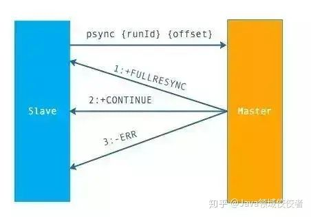


上面是 Psync 的执行流程，从节点发送 psync[runId][offset] 命令，主节点有三种响应：

- **FULLRESYNC：**第一次连接，进行全量复制
- **CONTINUE：**进行部分复制
- **ERR：**不支持 psync 命令，进行全量复制


**面试官：**很好，那你能具体说下全量复制和部分复制的过程吗？

**我：**可以！

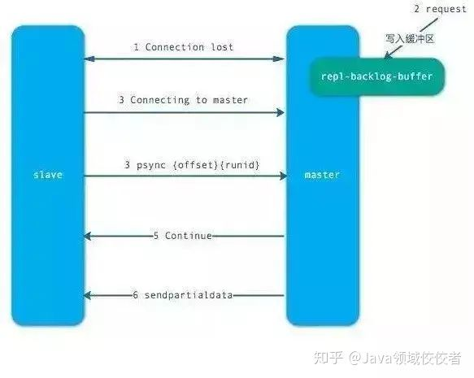


上面是全量复制的流程。主要有以下几步：

- 从节点发送 psync ? -1 命令（因为第一次发送，不知道主节点的 runId，所以为?，因为是第一次复制，所以 offset=-1）。
- 主节点发现从节点是第一次复制，返回 FULLRESYNC {runId} {offset}，runId 是主节点的 runId，offset 是主节点目前的 offset。
- 从节点接收主节点信息后，保存到 info 中。
- 主节点在发送 FULLRESYNC 后，启动 bgsave 命令，生成 RDB 文件（数据持久化）。
- 主节点发送 RDB 文件给从节点。到从节点加载数据完成这段期间主节点的写命令放入缓冲区。
- 从节点清理自己的数据库数据。
- 从节点加载 RDB 文件，将数据保存到自己的数据库中。如果从节点开启了 AOF，从节点会异步重写 AOF 文件。


关于部分复制有以下几点说明：

①部分复制主要是 Redis 针对全量复制的过高开销做出的一种优化措施，使用 psync[runId][offset] 命令实现。

当从节点正在复制主节点时，如果出现网络闪断或者命令丢失等异常情况时，从节点会向主节点要求补发丢失的命令数据，主节点的复制积压缓冲区将这部分数据直接发送给从节点。

这样就可以保持主从节点复制的一致性。补发的这部分数据一般远远小于全量数据。

②主从连接中断期间主节点依然响应命令，但因复制连接中断命令无法发送给从节点，不过主节点内的复制积压缓冲区依然可以保存最近一段时间的写命令数据。

③当主从连接恢复后，由于从节点之前保存了自身已复制的偏移量和主节点的运行 ID。因此会把它们当做 psync 参数发送给主节点，要求进行部分复制。

④主节点接收到 psync 命令后首先核对参数 runId 是否与自身一致，如果一致，说明之前复制的是当前主节点。

之后根据参数 offset 在复制积压缓冲区中查找，如果 offset 之后的数据存在，则对从节点发送+COUTINUE 命令，表示可以进行部分复制。因为缓冲区大小固定，若发生缓冲溢出，则进行全量复制。

⑤主节点根据偏移量把复制积压缓冲区里的数据发送给从节点，保证主从复制进入正常状态。

哨兵

**面试官：**那主从复制会存在哪些问题呢？

**我：**主从复制会存在以下问题：

- 一旦主节点宕机，从节点晋升为主节点，同时需要修改应用方的主节点地址，还需要命令所有从节点去复制新的主节点，整个过程需要人工干预。
- 主节点的写能力受到单机的限制。
- 主节点的存储能力受到单机的限制。
- 原生复制的弊端在早期的版本中也会比较突出，比如：Redis 复制中断后，从节点会发起 psync。
  此时如果同步不成功，则会进行全量同步，主库执行全量备份的同时，可能会造成毫秒或秒级的卡顿。

**面试官：**那比较主流的解决方案是什么呢？

**我：**当然是哨兵啊。

**面试官：**那么问题又来了。那你说下哨兵有哪些功能？

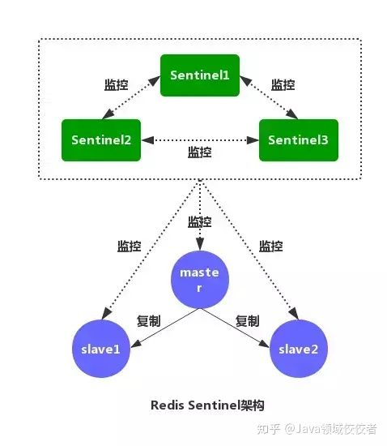


**我：**如图，是 Redis Sentinel（哨兵）的架构图。Redis Sentinel（哨兵）主要功能包括主节点存活检测、主从运行情况检测、自动故障转移、主从切换。

Redis Sentinel 最小配置是一主一从。Redis 的 Sentinel 系统可以用来管理多个 Redis 服务器。

该系统可以执行以下四个任务：

- **监控：**不断检查主服务器和从服务器是否正常运行。
- **通知：**当被监控的某个 Redis 服务器出现问题，Sentinel 通过 API 脚本向管理员或者其他应用程序发出通知。
- **自动故障转移：**当主节点不能正常工作时，Sentinel 会开始一次自动的故障转移操作，它会将与失效主节点是主从关系的其中一个从节点升级为新的主节点，并且将其他的从节点指向新的主节点，这样人工干预就可以免了。
- **配置提供者：**在 Redis Sentinel 模式下，客户端应用在初始化时连接的是 Sentinel 节点集合，从中获取主节点的信息。


**面试官：**那你能说下哨兵的工作原理吗？

**我：**话不多说，直接上图：

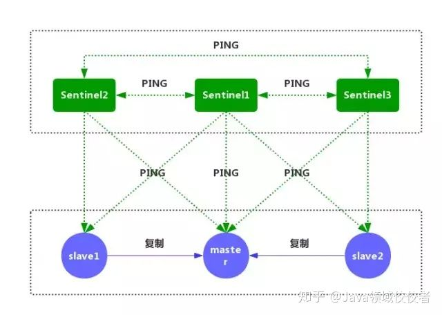


①每个 Sentinel 节点都需要定期执行以下任务：每个 Sentinel 以每秒一次的频率，向它所知的主服务器、从服务器以及其他的 Sentinel 实例发送一个 PING 命令。（如上图）

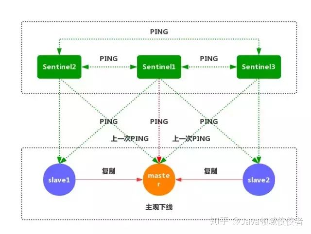


②如果一个实例距离最后一次有效回复 PING 命令的时间超过 down-after-milliseconds 所指定的值，那么这个实例会被 Sentinel 标记为主观下线。（如上图）

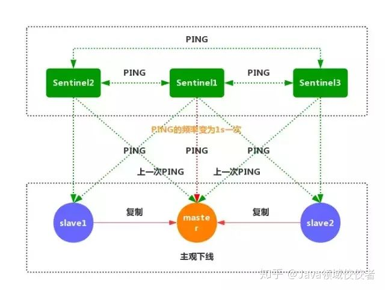


③如果一个主服务器被标记为主观下线，那么正在监视这个服务器的所有 Sentinel 节点，要以每秒一次的频率确认主服务器的确进入了主观下线状态。

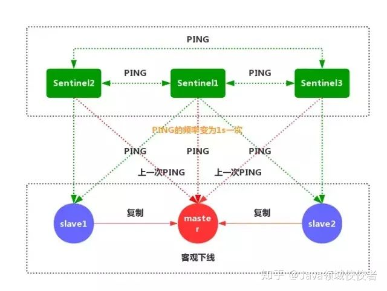


④如果一个主服务器被标记为主观下线，并且有足够数量的 Sentinel（至少要达到配置文件指定的数量）在指定的时间范围内同意这一判断，那么这个主服务器被标记为客观下线。

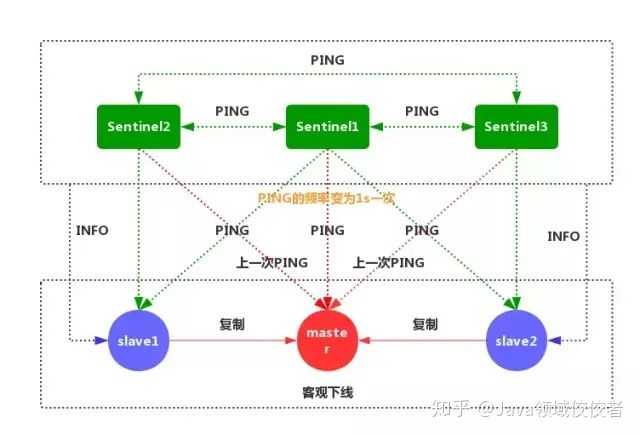

⑤一般情况下，每个 Sentinel 会以每 10 秒一次的频率向它已知的所有主服务器和从服务器发送 INFO 命令。

当一个主服务器被标记为客观下线时，Sentinel 向下线主服务器的所有从服务器发送 INFO 命令的频率，会从 10 秒一次改为每秒一次。

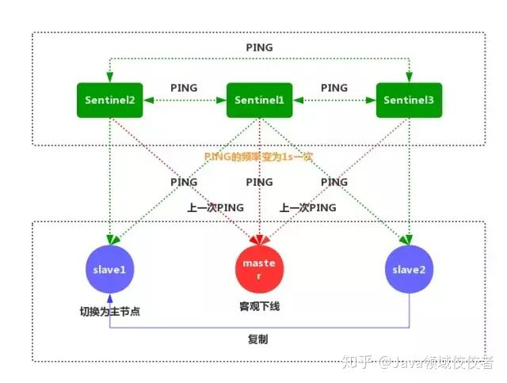


⑥Sentinel 和其他 Sentinel 协商客观下线的主节点的状态，如果处于 SDOWN 状态，则投票自动选出新的主节点，将剩余从节点指向新的主节点进行数据复制。

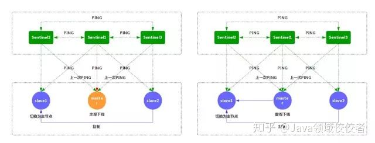

⑦当没有足够数量的 Sentinel 同意主服务器下线时，主服务器的客观下线状态就会被移除。

当主服务器重新向 Sentinel 的 PING 命令返回有效回复时，主服务器的主观下线状态就会被移除。

**面试官：**不错，面试前没少下工夫啊，今天 Redis 这关你过了，明天找个时间我们再聊聊其他的。（露出欣慰的微笑）

**我：**没问题。

**总结**

本文在一次面试的过程中讲述了 Redis 是什么，Redis 的特点和功能，Redis 缓存的使用，Redis 为什么能这么快，Redis 缓存的淘汰策略，持久化的两种方式，Redis 高可用部分的主从复制和哨兵的基本原理。


-----------

分析

- 总结类文章，适合事无巨细的总结
- 作为笔记类文体
