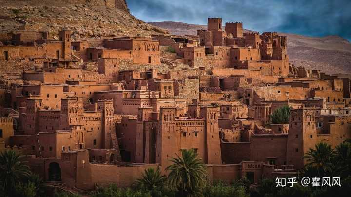

场景描写四字秘诀：**细、顺、悬、张。**

在新疆地区，有一种干草堆起来的架子，特别是在接近荒区的地方，架子是黄色的，干草也是枯黄的，一眼望去，就像一片同色的地毯，十分和谐。

**你的场景描写也应该如沙漠中的枯草架。**要和大环境大背景融为一体，成为一个螺丝钉，独立而又在整体中起重要作用。润物细无声，这就是关键。

场景分两种，**一种是动作场景，一种是反应场景。**

这两种场景构成了场景的大类别区分，其差别也简单，动作场景属于物理性质，反应场景属于情感性质。

- 所谓物理性质，即描写内容属于人物的外部条件、动作行为等基于客观物质的段落；
- 所谓情感性质，即描写内容属于人物精神，如爱恨情仇、高兴、痛苦等等。

## 一、细

在场景描写中，细是首要应该满足的条件。**所谓细，就是细节、详细、仔细**，不要对某个场景给出大而空泛的叙述。

错误示范：

> 黄河的水很浑浊，那是一条很长的河，黄河流经的省份也很多，黄河几乎占据了半个中国，黄河的水量相当充沛。

发现没，这里作者想要渲染黄河的浩瀚，但是从不展开讲，全是大而空的描述，只是简单地堆砌了一些描述而已。

修改后：

> 黄河的水很浑浊，那是一条很长的河，如果说赤道是地球的肚子，那黄河就能抵半根腰带。黄河流经的省份也很多，西起青海，东至山东，途径9个省份，流域面积达752443平方公里。

上下的差别很明显，修改后的段落把数据、包含的细节也阐述清楚了，还用了一个诙谐的比喻，高下立判。

再来一个极好的例子（出自左拉的《金钱》，本文引用注）：

> 这是一位有极好身材的女子，大家都很亲热地叫她嘉乐林夫人。第一次会见便特别使他惊异的是她的美丽的白头发，简直是一顶白发王冠；那头发在这个仅仅三十六岁的年轻的妇人额上产生出一种特殊的效力。从二十五岁时起，她的头发便这样变白了。她那始终乌黑而浓密的眉毛，在她那貂皮领围绕着的面庞上，保持了一种青春，一种奇特的活泼的神气。她从来也算不得是一个美人，她的下巴和她的鼻子太粗壮，她的下巴宽大，不过她那厚实的嘴唇却显出一种绝妙的和善态度。而这一头整齐的白发，这种丝一般的细发所闪耀出来的白光，的确使她略为严酷的外貌显得温和，给了她一种老祖母微笑时的娇媚，使她有一种美丽的情人的魔力和生气。她长得高大，结实，态度诚恳，高贵。

**细节要有灵魂，细到点上，每个细节之处都是为整体服务的**，这样才不会变成干瘪的堆砌。

## 二、顺

有了详细的子模块，还需要用一根线将他们串联起来，这就是故事发展的线索。一堆纯描述是无意义的，嵌入了整个故事发展，它们才会变得理所当然，读者们读到了就能发出“哦——原来是这样”的赞叹。

**最基本的便是时间线**，明显地告诉读者几点几分做了什么，几点几分又如何如何；**或发展线，**按事物发展的先后顺序来写。

比方说：

> 姥姥将右脚绷着，向鞋子口里溜进去，筋脉凸兀的手紧紧抓着门框，抖一抖袜子，将左脚轻轻抬起，打直了脚背往鞋里一扎，左右扭动几下，用手把后脚跟带起来，再跺一跺脚，让自己的脚更舒适些，满意地出门了。

这是一段非常精彩的发展场景描写，场景相当小，只有姥姥穿鞋这一个动作，但是前后连贯，衔接极其顺畅，隐藏于其中的发展线很不易被发现，可以说是一段教科书级的描写。

再如红楼梦，红楼梦是按章节片段分的，每一章几乎都按时间先后组织故事，上午干了什么，下午再干什么，这也是“顺”往大了写的一个好例子，大家有空可以读一读，体会一下。

## 三、悬

细节丰富，安排顺畅都满足了，那么就该设置情节了。“悬”是指悬念，

> “不要开灯。” 她说。
> 我不敢开灯，因为不想让街上的人看到。

怎么样？简单两句话就会带来很棒的效果。主人公在干嘛？为什么不开灯？是偷情？是杀人放火？是阴谋诡计？是商业间谍？没人知道，这强烈吸引人们往下读。

按照常规的解释，悬念是通过对剧情做悬而未决和结局难料的安排，以引起观众急欲知其结果的迫切期待心理的一种技巧。

悬念可以放在开头，也可以用在文中，甚至贯穿整个故事。

一个小场景想要出彩，也必须设置悬念，**没有悬念，就容易干涩无味，变成可有可无的一段“尿点”式描写。**

举个例子，

> 她家又遭罪了。在美丽的大草原上，经常出没一种“鬼怪”，平常人们见不着，但是一到夜里，“鬼怪”就开始活动起来，挑中了谁家，谁家就倒大霉。

然后再开始写这个“鬼怪”如何如何，如果你的场景小，那么就快速推进剧情，如果你的场景大，那就敞开写。这样就能把一个普通的场景写出花儿一般的灿烂。

提个问，谁能猜到这个“鬼怪”是什么？（wolf）

## 四、张

张是指紧张、张力。**你可以通过制造冲突来构建张力。**

冲突是小说写作中常用的技巧，悬念能勾起探索欲，而后面的冲突才是重点，如果只有悬念，后面的情节淡如水，那这个作品就算是废了，再好的悬念也带不动差劲的内容。

冲突可以通过人物之间、外部环境、人物内心情感来设定。

理论是抽象的，继续举例，

> 我的成绩出来后，就陷入了困境，603分，在我这个小县城算是最顶尖的一批了，但是父亲不准我去读大学。他说读大学根本没什么用，最后还不是出来跟别人打工，要是我去读大学，没人会给我学费，还说走了就别回来了。

这是来自外部环境的一个冲突，是父亲对“我”读大学的否决和“我”想要读大学的愿望之间产生的矛盾，平淡感就会在这种冲突中消失，剧情开始推进。

**在小型场景中，较多的是人物自我内心的冲突。**

- 比如要去做某件事，但是会离开家庭和孩子，让主人公不情愿；
- 又比如说主人公是在执行刺杀任务，但刺杀的对象是他的深爱者，这时党国的利益和自身的情感就会有剧烈的碰撞。

场景里一旦产生这样的张力，那么你距离写作大师就不远了。
