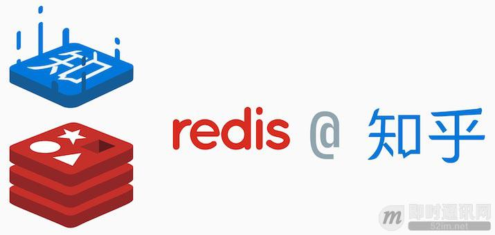
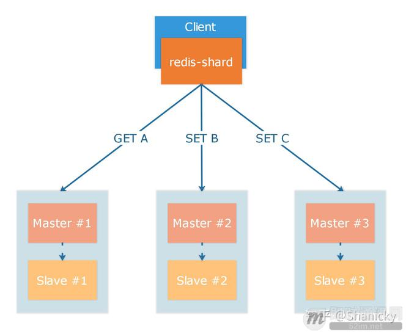
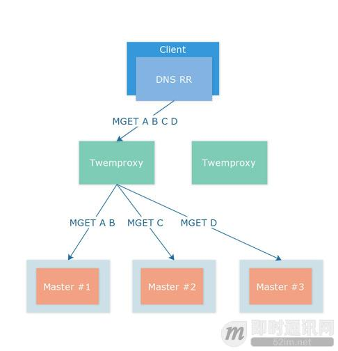
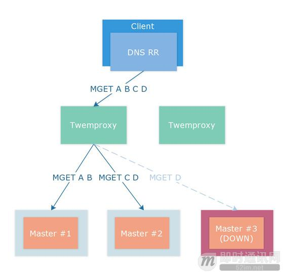
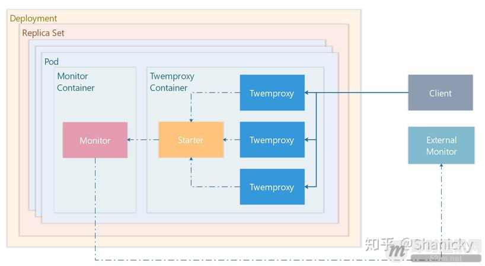
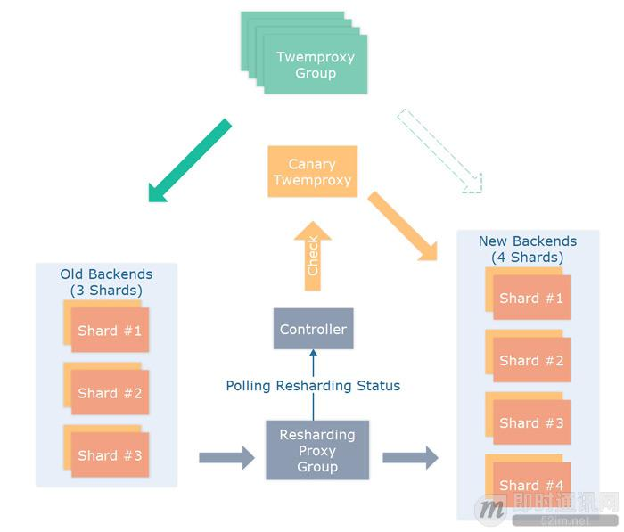

## 1、引言

知乎存储平台团队基于开源Redis 组件打造的知乎 Redis 平台，经过不断的研发迭代，目前已经形成了一整套完整自动化运维服务体系，提供很多强大的功能。本文作者陈鹏是该系统的负责人，本次文章深入介绍了该系统的方方面面，值得互联网后端程序员仔细研究。

## 2、关于作者

**陈鹏：**现任知乎存储平台组 Redis 平台技术负责人，2014 年加入知乎技术平台组从事基础架构相关系统的开发与运维，从无到有建立了知乎 Redis 平台，承载了知乎高速增长的业务流量。

## 3、技术背景

知乎作为知名中文知识内容平台，每日处理的访问量巨大 ，如何更好的承载这样巨大的访问量，同时提供稳定低时延的服务保证，是知乎技术平台同学需要面对的一大挑战。

知乎存储平台团队基于开源 Redis 组件打造的 Redis 平台管理系统，经过不断的研发迭代，目前已经形成了一整套完整自动化运维服务体系，提供一键部署集群，一键自动扩缩容, Redis 超细粒度监控，旁路流量分析等辅助功能。

**目前，Redis 在知乎的应用规模如下：**

- 1）机器内存总量约 70TB，实际使用内存约 40TB；
- 2）平均每秒处理约 1500 万次请求，峰值每秒约 2000 万次请求；
- 3）每天处理约 1 万亿余次请求；
- 4）单集群每秒处理最高每秒约 400 万次请求；
- 5）集群实例与单机实例总共约 800 个；
- 6）实际运行约 16000 个 Redis 实例；
- 7）Redis 使用官方 3.0.7 版本，少部分实例采用 4.0.11 版本。

## 4、知乎的Redis应用类型

根据业务的需求，我们将Redis实例区分为单机（Standalone）和集群（Cluster）两种类型，单机实例通常用于容量与性能要求不高的小型存储，而集群则用来应对对性能和容量要求较高的场景。

而在集群（Cluster）实例类型中，当实例需要的容量超过 20G 或要求的吞吐量超过 20万请求每秒时，我们会使用集群（Cluster）实例来承担流量。集群是通过中间件（客户端或中间代理等）将流量分散到多个 Redis 实例上的解决方案。知乎的 Redis 集群方案经历了两个阶段：客户端分片（2015年前使用的方案）与 Twemproxy 代理（2015年至今使用的方案）。

下面将分别来介绍这两个类型的Redis实例在知乎的应用实践情况。

## 5、知乎的Redis实例应用类型1：单机（Standalone）

对于单机实例，我们采用原生主从（Master-Slave）模式实现高可用，常规模式下对外仅暴露 Master 节点。由于使用原生 Redis，所以单机实例支持所有 Redis 指令。

对于单机实例，我们使用 Redis 自带的哨兵（Sentinel）集群对实例进行状态监控与 Failover。Sentinel 是 Redis 自带的高可用组件，将 Redis 注册到由多个 Sentinel 组成的 Sentinel 集群后，Sentinel 会对 Redis 实例进行健康检查，当 Redis 发生故障后，Sentinel 会通过 Gossip 协议进行故障检测，确认宕机后会通过一个简化的 Raft 协议来提升 Slave 成为新的 Master。

通常情况我们仅使用 1 个 Slave 节点进行冷备，如果有读写分离请求，可以建立多个 Read only slave 来进行读写分离。

如上图所示，通过向 Sentinel 集群注册 Master 节点实现实例的高可用，当提交 Master 实例的连接信息后，Sentinel 会主动探测所有的 Slave 实例并建立连接，定期检查健康状态。客户端通过多种资源发现策略如简单的 DNS 发现 Master 节点，将来有计划迁移到如 Consul 或 etcd 等资源发现组件 。

当 Master 节点发生宕机时，Sentinel 集群会提升 Slave 节点为新的 Master，同时在自身的 pubsub channel +switch-master 广播切换的消息，具体消息格式为：

switch-master <master name> <oldip> <oldport> <newip> <newport>

watcher 监听到消息后，会去主动更新资源发现策略，将客户端连接指向新的 Master 节点，完成 Failover，具体 Failover 切换过程详见 Redis 官方文档（[Redis Sentinel Documentation - Redis](https://redis.io/topics/sentinel)）。

**实际使用中需要注意以下几点：**

- 1）只读 Slave 节点可以按照需求设置 slave-priority 参数为 0，防止故障切换时选择了只读节点而不是热备 Slave 节点；
- 2）Sentinel 进行故障切换后会执行 CONFIG REWRITE 命令将 SLAVEOF 配置落地，如果 Redis 配置中禁用了 CONFIG 命令，切换时会发生错误，可以通过修改 Sentinel 代码来替换 CONFIG 命令；
- 3）Sentinel Group 监控的节点不宜过多，实测超过 500 个切换过程偶尔会进入 TILT 模式，导致 Sentinel 工作不正常，推荐部署多个 Sentinel 集群并保证每个集群监控的实例数量小于 300 个；
- 4）Master 节点应与 Slave 节点跨机器部署，有能力的使用方可以跨机架部署，不推荐跨机房部署 Redis 主从实例；
- 5）Sentinel 切换功能主要依赖 down-after-milliseconds 和 failover-timeout 两个参数，down-after-milliseconds 决定了 Sentinel 判断 Redis 节点宕机的超时，知乎使用 30000 作为阈值。而 failover-timeout 则决定了两次切换之间的最短等待时间，如果对于切换成功率要求较高，可以适当缩短 failover-timeout 到秒级保证切换成功，具体详见 Redis 官方文档；
- 6）单机网络故障等同于机器宕机，但如果机房全网发生大规模故障会造成主从多次切换，此时资源发现服务可能更新不够及时，需要人工介入。

## 6、知乎的Redis实例应用类型2：集群之客户端分片方案（2015以前使用）

早期知乎使用 redis-shard 进行客户端分片，redis-shard 库内部实现了 CRC32、MD5、SHA1 三种哈希算法 ，支持绝大部分 Redis 命令。使用者只需把 redis-shard 当成原生客户端使用即可，无需关注底层分片。

**基于客户端的分片模式具有如下优点：**

- 1）基于客户端分片的方案是集群方案中最快的，没有中间件，仅需要客户端进行一次哈希计算，不需要经过代理，没有官方集群方案的 MOVED/ASK 转向；
- 2）不需要多余的 Proxy 机器，不用考虑 Proxy 部署与维护；
- 3）可以自定义更适合生产环境的哈希算法。

**但是也存在如下问题：**

- 1）需要每种语言都实现一遍客户端逻辑，早期知乎全站使用 Python 进行开发，但是后来业务线增多，使用的语言增加至 Python，Golang，Lua，C/C++，JVM 系（Java，Scala，Kotlin）等，维护成本过高；
- 2）无法正常使用 MSET、MGET 等多种同时操作多个 Key 的命令，需要使用 Hash tag 来保证多个 Key 在同一个分片上；
- 3）升级麻烦，升级客户端需要所有业务升级更新重启，业务规模变大后无法推动；
- 4）扩容困难，存储需要停机使用脚本 Scan 所有的 Key 进行迁移，缓存只能通过传统的翻倍取模方式进行扩容；
- 5）由于每个客户端都要与所有的分片建立池化连接，客户端基数过大时会造成 Redis 端连接数过多，Redis 分片过多时会造成 Python 客户端负载升高。

具体特点详见：https://github.com/zhihu/redis-shard

早期知乎大部分业务由 Python 构建，Redis 使用的容量波动较小， redis-shard 很好地应对了这个时期的业务需求，在当时是一个较为不错解决方案。

## 7、知乎的Redis实例应用类型2：集群之Twemproxy 集群方案（2015之今在用）

2015 年开始，业务上涨迅猛，Redis 需求暴增，原有的 redis-shard 模式已经无法满足日益增长的扩容需求，我们开始调研多种集群方案，最终选择了简单高效的 Twemproxy 作为我们的集群方案。

**由 Twitter 开源的 Twemproxy 具有如下优点：**

- 1）性能很好且足够稳定，自建内存池实现 Buffer 复用，代码质量很高；
- 2）支持 fnv1a_64、murmur、md5 等多种哈希算法；
- 3）支持一致性哈希（ketama），取模哈希（modula）和随机（random）三种分布式算法。

具体特点详见：https://github.com/twitter/twemproxy

**但是缺点也很明显：**

- 1）单核模型造成性能瓶颈；
- 2）传统扩容模式仅支持停机扩容。

对此，我们将集群实例分成两种模式，即缓存（Cache）和存储（Storage）：

如果使用方可以接收通过损失一部分少量数据来保证可用性，或使用方可以从其余存储恢复实例中的数据，这种实例即为缓存，其余情况均为存储。

我们对缓存和存储采用了不同的策略，请继续往下读。

### 7.1存储

对于存储我们使用 fnv1a_64 算法结合 modula 模式即取模哈希对 Key 进行分片，底层 Redis 使用单机模式结合 Sentinel 集群实现高可用，默认使用 1 个 Master 节点和 1 个 Slave 节点提供服务，如果业务有更高的可用性要求，可以拓展 Slave 节点。

当集群中 Master 节点宕机，按照单机模式下的高可用流程进行切换，Twemproxy 在连接断开后会进行重连，对于存储模式下的集群，我们不会设置 auto_eject_hosts, 不会剔除节点。

同时，对于存储实例，我们默认使用 noeviction 策略，在内存使用超过规定的额度时直接返回 OOM 错误，不会主动进行 Key 的删除，保证数据的完整性。

由于 Twemproxy 仅进行高性能的命令转发，不进行读写分离，所以默认没有读写分离功能，而在实际使用过程中，我们也没有遇到集群读写分离的需求，如果要进行读写分离，可以使用资源发现策略在 Slave 节点上架设 Twemproxy 集群，由客户端进行读写分离的路由。

### 7.2缓存

考虑到对于后端（MySQL/HBase/RPC 等）的压力，知乎绝大部分业务都没有针对缓存进行降级，这种情况下对缓存的可用性要求较数据的一致性要求更高，但是如果按照存储的主从模式实现高可用，1 个 Slave 节点的部署策略在线上环境只能容忍 1 台物理节点宕机，N 台物理节点宕机高可用就需要至少 N 个 Slave 节点，这无疑是种资源的浪费。

所以我们采用了 Twemproxy 一致性哈希（Consistent Hashing）策略来配合 auto_eject_hosts 自动弹出策略组建 Redis 缓存集群。

对于缓存我们仍然使用使用 fnv1a_64 算法进行哈希计算，但是分布算法我们使用了 ketama 即一致性哈希进行 Key 分布。缓存节点没有主从，每个分片仅有 1 个 Master 节点承载流量。

Twemproxy 配置 auto_eject_hosts 会在实例连接失败超过 server_failure_limit 次的情况下剔除节点，并在 server_retry_timeout 超时之后进行重试，剔除后配合 ketama 一致性哈希算法重新计算哈希环，恢复正常使用，这样即使一次宕机多个物理节点仍然能保持服务。

**在实际的生产环境中需要注意以下几点：**

- 1）剔除节点后，会造成短时间的命中率下降，后端存储如 MySQL、HBase 等需要做好流量监测；
- 2）线上环境缓存后端分片不宜过大，建议维持在 20G 以内，同时分片调度应尽可能分散，这样即使宕机一部分节点，对后端造成的额外的压力也不会太多；
- 3）机器宕机重启后，缓存实例需要清空数据之后启动，否则原有的缓存数据和新建立的缓存数据会冲突导致脏缓存。直接不启动缓存也是一种方法，但是在分片宕机期间会导致周期性 server_failure_limit 次数的连接失败；
- 4）server_retry_timeout 和 server_failure_limit 需要仔细敲定确认，知乎使用 10min 和 3 次作为配置，即连接失败 3 次后剔除节点，10 分钟后重新进行连接。

### 7.3Twemproxy 部署

在方案早期我们使用数量固定的物理机部署 Twemproxy，通过物理机上的 Agent 启动实例，Agent 在运行期间会对 Twemproxy 进行健康检查与故障恢复，由于 Twemproxy 仅提供全量的使用计数，所以 Agent 运行时还会进行定时的差值计算来计算 Twemproxy 的 requests_per_second 等指标。

后来为了更好地故障检测和资源调度，我们引入了 Kubernetes，将 Twemproxy 和 Agent 放入同一个 Pod 的两个容器内，底层 Docker 网段的配置使每个 Pod 都能获得独立的 IP，方便管理。

最开始，本着简单易用的原则，我们使用 DNS A Record 来进行客户端的资源发现，每个 Twemproxy 采用相同的端口号，一个 DNS A Record 后面挂接多个 IP 地址对应多个 Twemproxy 实例。

初期，这种方案简单易用，但是到了后期流量日益上涨，单集群 Twemproxy 实例个数很快就超过了 20 个。由于 DNS 采用的 UDP 协议有 512 字节的包大小限制，单个 A Record 只能挂接 20 个左右的 IP 地址，超过这个数字就会转换为 TCP 协议，客户端不做处理就会报错，导致客户端启动失败。

当时由于情况紧急，只能建立多个 Twemproxy Group，提供多个 DNS A Record 给客户端，客户端进行轮询或者随机选择，该方案可用，但是不够优雅。

### 7.4如何解决 Twemproxy 单 CPU 计算能力的限制

之后我们修改了 Twemproxy 源码， 加入 SO_REUSEPORT 支持。

**Twemproxy with SO_REUSEPORT on Kubernetes：**

同一个容器内由 Starter 启动多个 Twemproxy 实例并绑定到同一个端口，由操作系统进行负载均衡，对外仍然暴露一个端口，但是内部已经由系统均摊到了多个 Twemproxy 上。

同时 Starter 会定时去每个 Twemproxy 的 stats 端口获取 Twemproxy 运行状态进行聚合，此外 Starter 还承载了信号转发的职责。

原有的 Agent 不需要用来启动 Twemproxy 实例，所以 Monitor 调用 Starter 获取聚合后的 stats 信息进行差值计算，最终对外界暴露出实时的运行状态信息。

### 7.5为什么没有使用官方 Redis 集群方案

我们在 2015 年调研过多种集群方案，综合评估多种方案后，最终选择了看起来较为陈旧的 Twemproxy 而不是官方 Redis 集群方案与 Codis，具体原因如下：

***1）MIGRATE 造成的阻塞问题：\***

Redis 官方集群方案使用 CRC16 算法计算哈希值并将 Key 分散到 16384 个 Slot 中，由使用方自行分配 Slot 对应到每个分片中，扩容时由使用方自行选择 Slot 并对其进行遍历，对 Slot 中每一个 Key 执行 [MIGRATE](https://redis.io/commands/migrate) 命令进行迁移。

调研后发现，MIGRATE 命令实现分为三个阶段：

- a）DUMP 阶段：由源实例遍历对应 Key 的内存空间，将 Key 对应的 Redis Object 序列化，序列化协议跟 Redis RDB 过程一致；
- b）RESTORE 阶段：由源实例建立 TCP 连接到对端实例，并将 DUMP 出来的内容使用 RESTORE 命令到对端进行重建，新版本的 Redis 会缓存对端实例的连接；
- c）DEL 阶段（可选）：如果发生迁移失败，可能会造成同名的 Key 同时存在于两个节点，此时 MIGRATE 的 REPLACE 参数决定是是否覆盖对端的同名 Key，如果覆盖，对端的 Key 会进行一次删除操作，4.0 版本之后删除可以异步进行，不会阻塞主进程。

经过调研，我们认为这种模式并不适合知乎的生产环境。Redis 为了保证迁移的一致性， MIGRATE 所有操作都是同步操作，执行 MIGRATE 时，两端的 Redis 均会进入时长不等的 BLOCK 状态。

对于小 Key，该时间可以忽略不计，但如果一旦 Key 的内存使用过大，一个 MIGRATE 命令轻则导致 P95 尖刺，重则直接触发集群内的 Failover，造成不必要的切换

同时，迁移过程中访问到处于迁移中间状态的 Slot 的 Key 时，根据进度可能会产生 ASK 转向，此时需要客户端发送 ASKING 命令到 Slot 所在的另一个分片重新请求，请求时延则会变为原来的两倍。

同样，方案初期时的 Codis 采用的是相同的 MIGRATE 方案，但是使用 Proxy 控制 Redis 进行迁移操作而非第三方脚本（如 redis-trib.rb），基于同步的类似 MIGRATE 的命令，实际跟 Redis 官方集群方案存在同样的问题。

对于这种 Huge Key 问题决定权完全在于业务方，有时业务需要不得不产生 Huge Key 时会十分尴尬，如关注列表。一旦业务使用不当出现超过 1MB 以上的大 Key 便会导致数十毫秒的延迟，远高于平时 Redis 亚毫秒级的延迟。有时，在 slot 迁移过程中业务不慎同时写入了多个巨大的 Key 到 slot 迁移的源节点和目标节点，除非写脚本删除这些 Key ，否则迁移会进入进退两难的地步。

对此，Redis 作者在 Redis 4.2 的 [roadmap](https://gist.github.com/antirez/a3787d538eec3db381a41654e214b31d) 中提到了 Non blocking MIGRATE 但是截至目前，Redis 5.0 即将正式发布，仍未看到有关改动，社区中已经有相关的 [Pull Request](https://github.com/antirez/redis/pull/3997) ，该功能可能会在 5.2 或者 6.0 之后并入 master 分支，对此我们将持续观望。

***2）缓存模式下高可用方案不够灵活：\***

还有，官方集群方案的高可用策略仅有主从一种，高可用级别跟 Slave 的数量成正相关，如果只有一个 Slave，则只能允许一台物理机器宕机， Redis 4.2 roadmap 提到了 cache-only mode，提供类似于 Twemproxy 的自动剔除后重分片策略，但是截至目前仍未实现。

***3）内置 Sentinel 造成额外流量负载：\***

另外，官方 Redis 集群方案将 Sentinel 功能内置到 Redis 内，这导致在节点数较多（大于 100）时在 Gossip 阶段会产生大量的 PING/INFO/CLUSTER INFO 流量，根据 issue 中提到的情况，200 个使用 3.2.8 版本节点搭建的 Redis 集群，在没有任何客户端请求的情况下，每个节点仍然会产生 40Mb/s 的流量，虽然到后期 Redis 官方尝试对其进行压缩修复，但按照 Redis 集群机制，节点较多的情况下无论如何都会产生这部分流量，对于使用大内存机器但是使用千兆网卡的用户这是一个值得注意的地方。

***4）slot 存储开销：\***

最后，每个 Key 对应的 Slot 的存储开销，在规模较大的时候会占用较多内存，4.x 版本以前甚至会达到实际使用内存的数倍，虽然 4.x 版本使用 rax 结构进行存储，但是仍然占据了大量内存，从非官方集群方案迁移到官方集群方案时，需要注意这部分多出来的内存。

总之，官方 Redis 集群方案与 Codis 方案对于绝大多数场景来说都是非常优秀的解决方案，但是我们仔细调研发现并不是很适合集群数量较多且使用方式多样化的我们，场景不同侧重点也会不一样，但在此仍然要感谢开发这些组件的开发者们，感谢你们对 Redis 社区的贡献。

## 8、知乎Redis实例的扩容实践

### 8.1静态扩容

对于单机实例，如果通过调度器观察到对应的机器仍然有空闲的内存，我们仅需直接调整实例的 maxmemory 配置与报警即可。同样，对于集群实例，我们通过调度器观察每个节点所在的机器，如果所有节点所在机器均有空闲内存，我们会像扩容单机实例一样直接更新 maxmemory 与报警。

### 8.2动态扩容

**但是当机器空闲内存不够，或单机实例与集群的后端实例过大时，无法直接扩容，需要进行动态扩容：**

- 1）对于单机实例，如果单实例超过 30GB 且没有如 sinterstore 之类的多 Key 操作我们会将其扩容为集群实例；
- 2）对于集群实例，我们会进行横向的重分片，我们称之为 Resharding 过程。

**Resharding 过程：**

原生 Twemproxy 集群方案并不支持扩容，我们开发了数据迁移工具来进行 Twemproxy 的扩容，迁移工具本质上是一个上下游之间的代理，将数据从上游按照新的分片方式搬运到下游。

原生 Redis 主从同步使用 SYNC/PSYNC 命令建立主从连接，收到 SYNC 命令的 Master 会 fork 出一个进程遍历内存空间生成 RDB 文件并发送给 Slave，期间所有发送至 Master 的写命令在执行的同时都会被缓存到内存的缓冲区内，当 RDB 发送完成后，Master 会将缓冲区内的命令及之后的写命令转发给 Slave 节点。

我们开发的迁移代理会向上游发送 SYNC 命令模拟上游实例的 Slave，代理收到 RDB 后进行解析，由于 RDB 中每个 Key 的格式与 RESTORE 命令的格式相同，所以我们使用生成 RESTORE 命令按照下游的 Key 重新计算哈希并使用 Pipeline 批量发送给下游。

等待 RDB 转发完成后，我们按照新的后端生成新的 Twemproxy 配置，并按照新的 Twemproxy 配置建立 Canary 实例，从上游的 Redis 后端中取 Key 进行测试，测试 Resharding 过程是否正确，测试过程中的 Key 按照大小，类型，TTL 进行比较。

测试通过后，对于集群实例，我们使用生成好的配置替代原有 Twemproxy 配置并 restart/reload Twemproxy 代理，我们修改了 Twemproxy 代码，加入了 config reload 功能，但是实际使用中发现直接重启实例更加可控。而对于单机实例，由于单机实例和集群实例对于命令的支持不同，通常需要和业务方确定后手动重启切换。

由于 Twemproxy 部署于 Kubernetes ，我们可以实现细粒度的灰度，如果客户端接入了读写分离，我们可以先将读流量接入新集群，最终接入全部流量。

这样相对于 Redis 官方集群方案，除在上游进行 BGSAVE 时的 fork 复制页表时造成的尖刺以及重启时造成的连接闪断，其余对于 Redis 上游造成的影响微乎其微。

**这样扩容存在的问题：**

*1）对上游发送 SYNC 后，上游 fork 时会造成尖刺：*

- \- 对于存储实例，我们使用 Slave 进行数据同步，不会影响到接收请求的 Master 节点；
- \- 对于缓存实例，由于没有 Slave 实例，该尖刺无法避免，如果对于尖刺过于敏感，我们可以跳过 RDB 阶段，直接通过 PSYNC 使用最新的 SET 消息建立下游的缓存。

*2）切换过程中有可能写到下游，而读在上游：*

- \- 对于接入了读写分离的客户端，我们会先切换读流量到下游实例，再切换写流量。

*3）一致性问题，两条具有先后顺序的写同一个 Key 命令在切换代理后端时会通过 1）写上游同步到下游 2）直接写到下游两种方式写到下游，此时，可能存在应先执行的命令却通过 1）执行落后于通过 2）执行，导致命令先后顺序倒置：*

- \- 这个问题在切换过程中无法避免，好在绝大部分应用没有这种问题，如果无法接受，只能通过上游停写排空 Resharding 代理保证先后顺序；
- \- 官方 Redis 集群方案和 Codis 会通过 blocking 的 migrate 命令来保证一致性，不存在这种问题。

实际使用过程中，如果上游分片安排合理，可实现数千万次每秒的迁移速度，1TB 的实例 Resharding 只需要半小时左右。另外，对于实际生产环境来说，提前做好预期规划比遇到问题紧急扩容要快且安全得多。

## 9、旁路分析实践

由于生产环境调试需要，有时会需要监控线上 Redis 实例的访问情况，Redis 提供了多种监控手段，如 MONITOR 命令。

但由于 Redis 单线程的限制，导致自带的 MONITOR 命令在负载过高的情况下会再次跑高 CPU，对于生产环境来说过于危险，而其余方式如 [Keyspace Notify](https://redis.io/topics/notifications) 只有写事件，没有读事件，无法做到细致的观察。

对此我们开发了基于 libpcap 的旁路分析工具，系统层面复制流量，对应用层流量进行协议分析，实现旁路 MONITOR，实测对于运行中的实例影响微乎其微。

同时对于没有 MONITOR 命令的 Twemproxy，旁路分析工具仍能进行分析，由于生产环境中绝大部分业务都使用 Kubernetes 部署于 Docker 内 ，每个容器都有对应的独立 IP，所以可以使用旁路分析工具反向解析找出客户端所在的应用，分析业务方的使用模式，防止不正常的使用。

## 10、将来的工作

由于 Redis 5.0 发布在即，4.0 版本趋于稳定，我们将逐步升级实例到 4.0 版本，由此带来的如 MEMORY 命令、Redis Module 、新的 LFU 算法等特性无论对运维方还是业务方都有极大的帮助。

## 11、写在最后

知乎架构平台团队是支撑整个知乎业务的基础技术团队，开发和维护着知乎几乎全量的核心基础组件，包括容器、Redis、MySQL、Kafka、LB、HBase 等核心基础设施，团队小而精，每个同学都独当一面负责上面提到的某个核心系统。

随着知乎业务规模的快速增长，以及业务复杂度的持续增加，我们团队面临的技术挑战也越来越大，欢迎对技术感兴趣、渴望技术挑战的小伙伴加入我们，一起建设稳定高效的知乎云平台。
